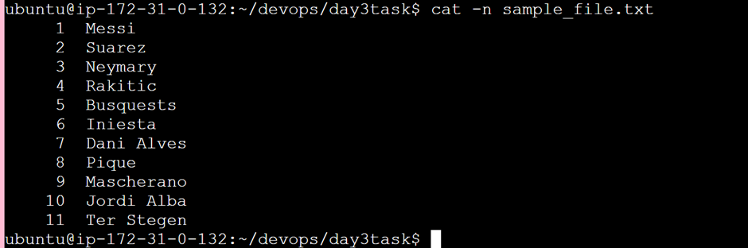
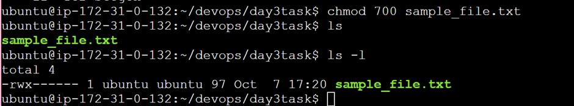
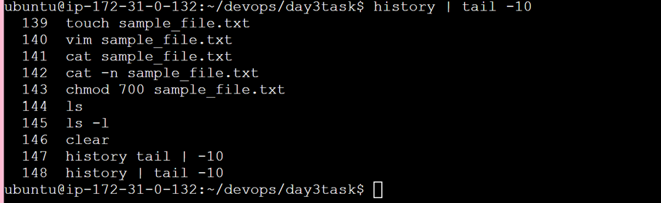
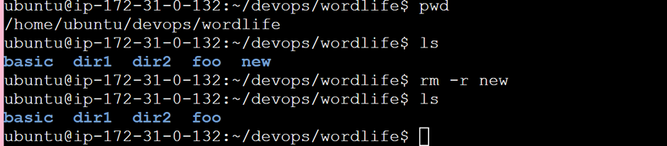
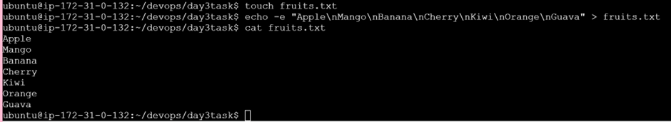
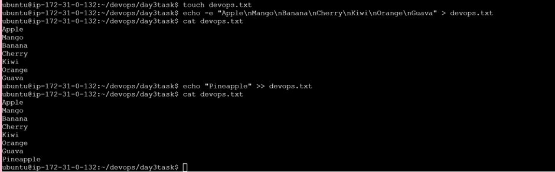
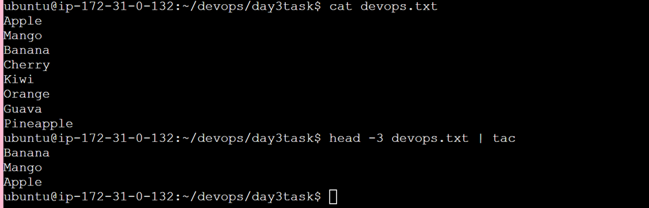
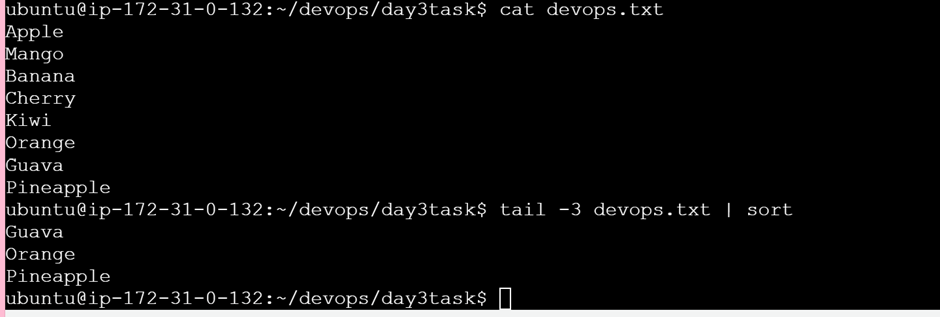
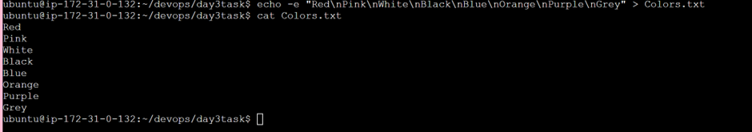
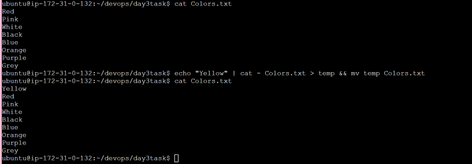

# Day 3 Tasks

## Task 1: View the content of a file and display line numbers
- **Command:** `cat -n filename`
- **Explanation:** Displays the content of the file with line numbers.



---

## Task 2: Change the access permissions of files to make them readable, writable, and executable by the owner only
- **Command:** `chmod 700 filename`
- **Explanation:** Changes permissions so that the owner can read, write, and execute, but others cannot.



---

## Task 3: Check the last 10 commands you have run
- **Command:** `history | tail -10`
- **Explanation:** Shows the last 10 commands from the history.



---

## Task 4: Remove a directory and all its contents
- **Command:** `rm -r directory_name`
- **Explanation:** Recursively deletes a directory and its contents.



---

## Task 5: Create a `fruits.txt` file, add content (one fruit per line), and display the content
- **Command:**
  ```bash
  echo -e "Apple\nMango\nBanana\nCherry\nKiwi\nOrange\nGuava" > fruits.txt
  cat fruits.txt
  ```
- **Explanation:** Creates `fruits.txt` and adds fruits, one per line.



---

## Task 6: Add content in `devops.txt` and append "Pineapple" to the end of the file
- **Command:**
  ```bash
  echo -e "Apple\nMango\nBanana\nCherry\nKiwi\nOrange\nGuava" > devops.txt
  echo "Pineapple" >> devops.txt
  ```
- **Explanation:** Adds content to `devops.txt` and appends "Pineapple".



---

## Task 7: Show the first three fruits from the file in reverse order
- **Command:** `head -3 fruits.txt | tac`
- **Explanation:** Displays the first three lines of `fruits.txt` in reverse order.



---

## Task 8: Show the bottom three fruits from the file, and then sort them alphabetically
- **Command:** `tail -3 fruits.txt | sort`
- **Explanation:** Displays the bottom three fruits, sorted alphabetically.



---

## Task 9: Create another file `Colors.txt`, add content (one color per line), and display the content
- **Command:**
  ```bash
  echo -e "Red\nPink\nWhite\nBlack\nBlue\nOrange\nPurple\nGrey" > Colors.txt
  cat Colors.txt
  ```
- **Explanation:** Creates `Colors.txt` and adds colors.



---

## Task 10: Prepend "Yellow" to the beginning of `Colors.txt`
- **Command:** `echo "Yellow" | cat - Colors.txt > temp && mv temp Colors.txt`
- **Explanation:** Prepends "Yellow" to `Colors.txt`.



---

## Task 11: Find and display the lines that are common between `fruits.txt` and `Colors.txt`
- **Command:** `comm -12 <(sort fruits.txt) <(sort Colors.txt)`
- **Explanation:** Displays lines that are common between both files.


---

## Task 12: Count the number of lines, words, and characters in both `fruits.txt` and `Colors.txt`
- **Command:** `wc fruits.txt Colors.txt`
- **Explanation:** Counts the lines, words, and characters in both files.


