# Day 5 Answers: Advanced Linux Shell Scripting for DevOps Engineers with User Management

### Tasks

1. **Create Directories Using Shell Script:**
   - Write a bash script `createDirectories.sh` that, when executed with three arguments (directory name, start number of directories, and end number of directories), creates a specified number of directories with a dynamic directory name.
   - Example 1: When executed as `./createDirectories.sh day 1 90`, it creates 90 directories as `day1 day2 day3 ... day90`.
   - Example 2: When executed as `./createDirectories.sh Movie 20 50`, it creates 31 directories as `Movie20 Movie21 Movie22 ... Movie50`.

   **Answer**
   
   - Creating createDirectories.sh and adding below content : 
   ``` bash

      #!/bin/bash

      <<Info
      Author       : Amitabh Soni
      Date         : 25/11/24
      Description  : This script takes three arguments and creates a specified number of directories at once.

      Example      : When executed as ./createDirectories.sh day 1 90, it creates 90 directories as day1, day2, day3, ... day90.
      Info

      # For loop to create directories iteratively
      for i in $(seq $2 $3); do
          mkdir "$1$i"
      done

   ```
      

   - createDirectories.sh
   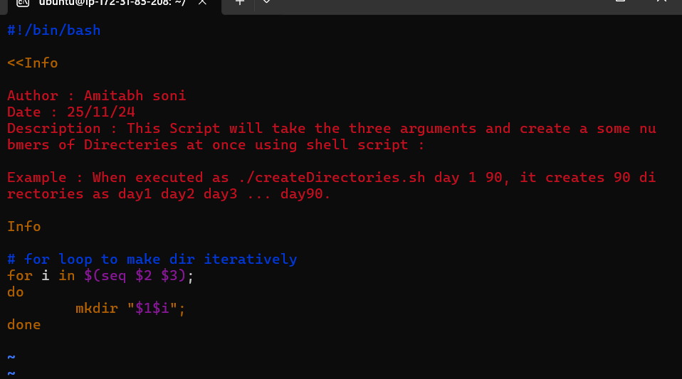   

2. **Create a Script to Backup All Your Work:**
   - Backups are an important part of a DevOps Engineer's day-to-day activities. The video in the references will help you understand how a DevOps Engineer takes backups (it can feel a bit difficult but keep trying, nothing is impossible).

   **Answer**

   - Creating a `backup.sh` file and executing after adding the below content:

      ```bash
      #!/bin/bash

      <<Info
      Author       : Amitabh Soni
      Date         : 25/11/25
      Description  : This script will take backup of any directory or file and store it in the backup directory: /home/ubuntu/Day-05/backup
      Info

      # Creating a function for backup creation
      function create_backup() {
          # Timestamp for backup naming
          timestamp=$(date '+%Y-%m-%d_%H-%M-%S')

          # Target directory where backups are stored
          target_dir="/home/ubuntu/Day-05/backup"

          # Backup filename
          backup_file="${target_dir}/backup_${timestamp}.zip"

          # Create zip backup
          zip -r "$backup_file" "$1"

          # Checking if the previous command successfully ran or not
          if [ $? -eq 0 ]; then
              echo "Backup created: ${backup_file}"
          else
              echo "Error: Failed to create backup."
              return 1
          fi
      }

      create_backup "$1"

      ```

   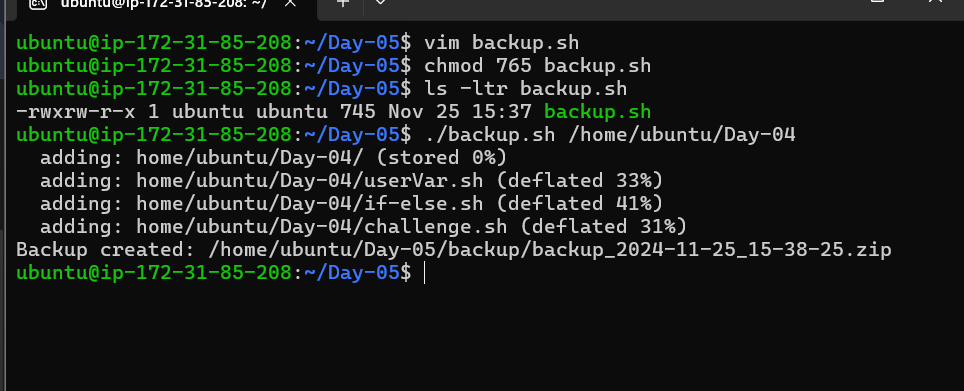

   - backup.sh : 
   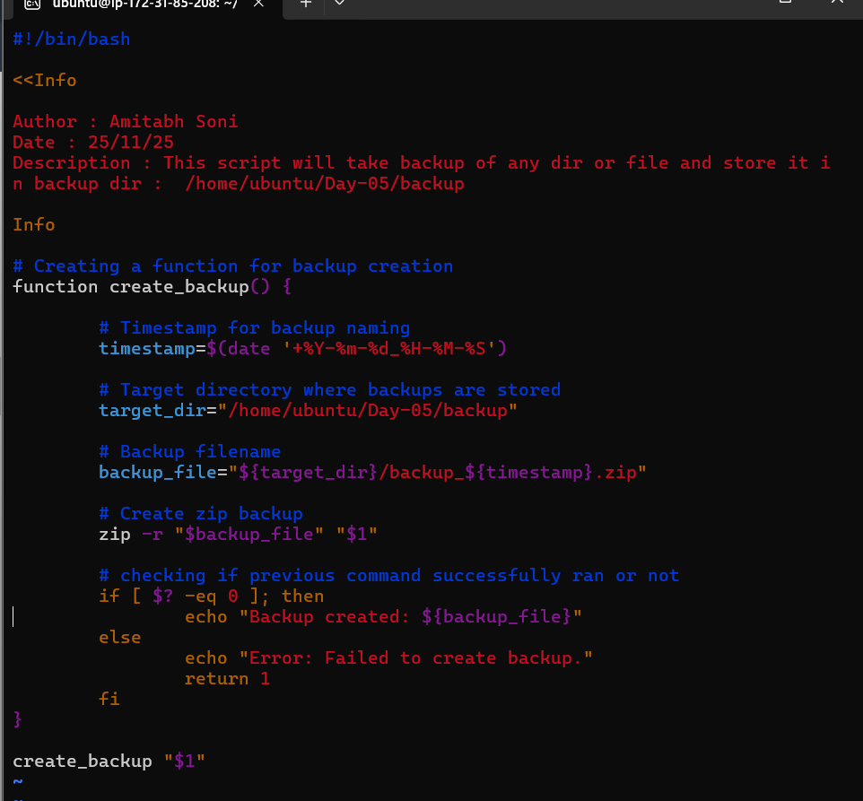

   - Output image : 
   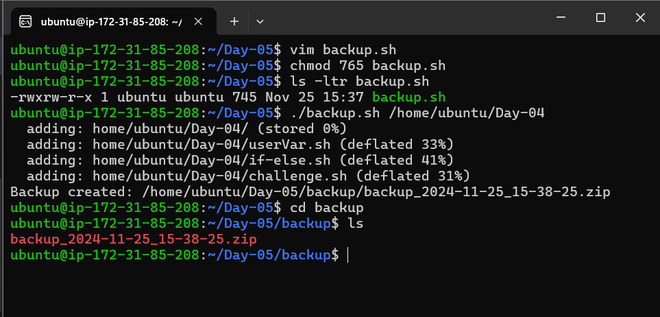

3. **Read About Cron and Crontab to Automate the Backup Script:**
   - Cron is the system's main scheduler for running jobs or tasks unattended. A command called crontab allows the user to submit, edit, or delete entries to cron. A crontab file is a user file that holds the scheduling information.

   **Answer**
   
   - Editing crontab for auto backup : 
   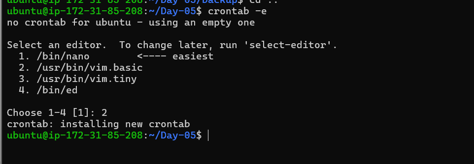

   - setting a backup of Day-04 in every minute : 
   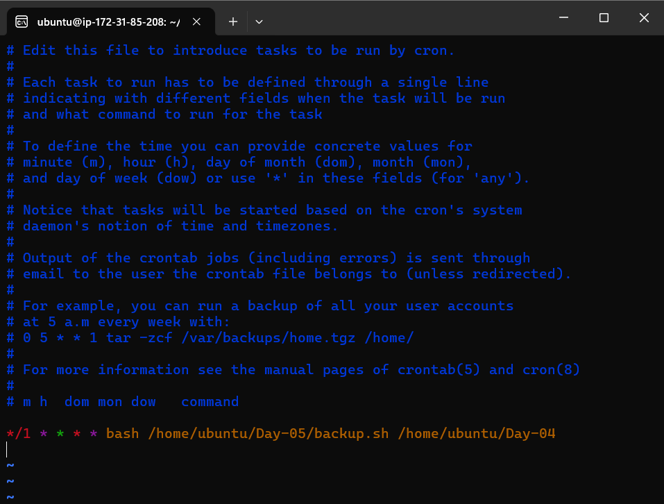
   
   - Ensuring whether it creates backup in one minute or not : 
   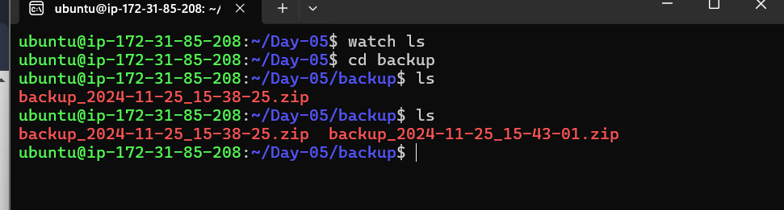

   - checking realtime update in backup dir through 'watch ls' command : 
   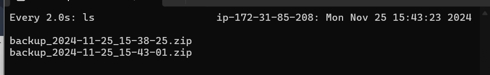

   - It works for every minute :
   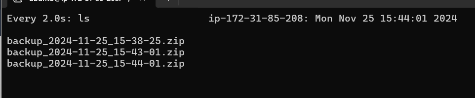
   
   - Final check for backup : 
   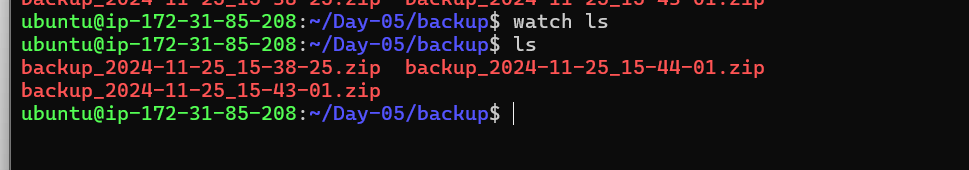

4. **Read About User Management:**
   - A user is an entity in a Linux operating system that can manipulate files and perform several other operations. Each user is assigned an ID that is unique within the system. IDs 0 to 999 are assigned to system users, and local user IDs start from 1000 onwards.
   - Create 2 users and display their usernames.

   **Answer**
   
   - Creating users and printing there names
   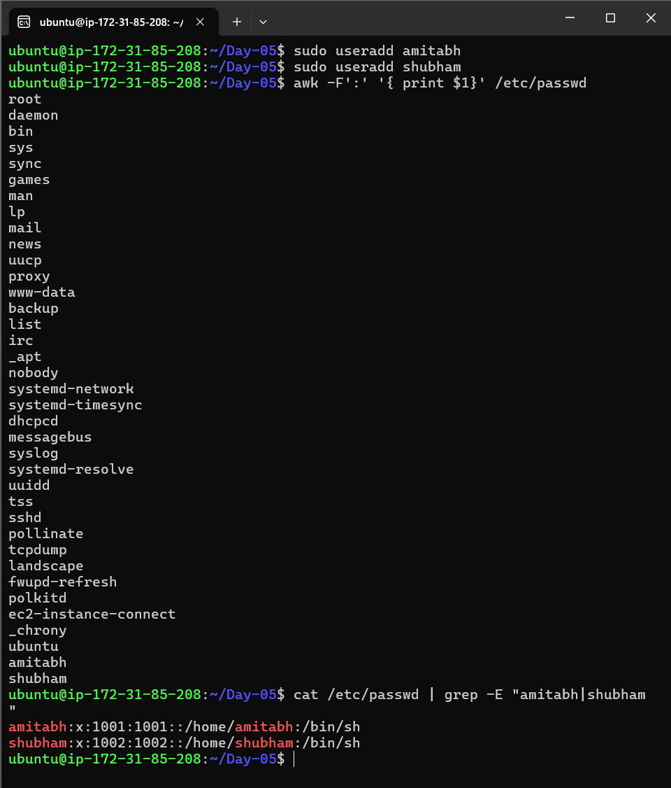
   
   - Setting up password the new users
   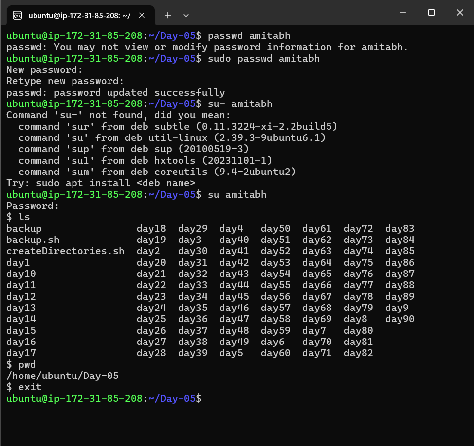

[LinkedIn](https://www.linkedin.com/in/amitabh-devops/).
