# Day 6 Answers: File Permissions and Access Control Lists

### Tasks

1. **Understanding File Permissions:**
   - Create a simple file and run `ls -ltr` to see the details of the files.
   - Each of the three permissions are assigned to three defined categories of users. The categories are:
     - **Owner:** The owner of the file or application.
       - Use `chown` to change the ownership permission of a file or directory.

        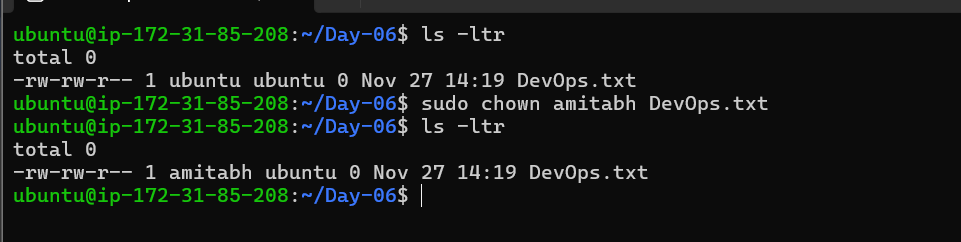

     - **Group:** The group that owns the file or application.
       - Use `chgrp` to change the group permission of a file or directory.

        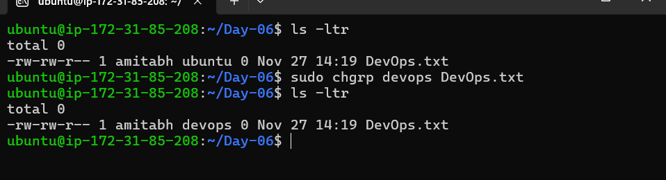

     - **Others:** All users with access to the system (outside the users in a group).
       - Use `chmod` to change the other users' permissions of a file or directory.

        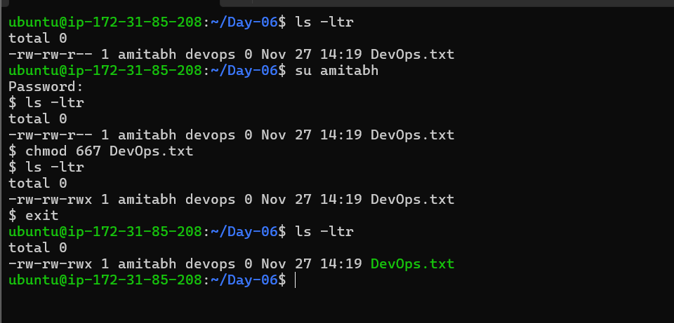

   - Task: Change the user permissions of the file and note the changes after running `ls -ltr`.

    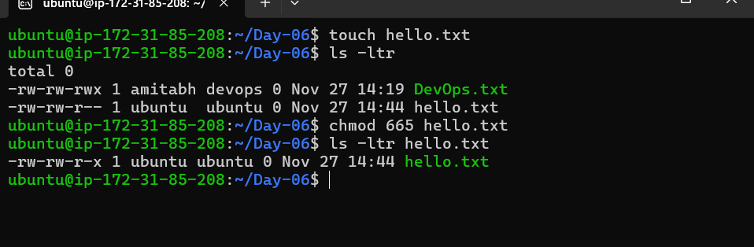


2. **Writing an Article:**
   - Write an article about file permissions based on your understanding from the notes.

   Article : [hashnode blog](https://amitabhdevops.hashnode.dev/understanding-file-permissions-in-linux-a-beginners-guide)

3. **Access Control Lists (ACL):**
   - Read about ACL and try out the commands `getfacl` and `setfacl`.
   - got to know about `getfacl` and `setfacl` through : https://www.geeksforgeeks.org/access-control-listsacl-linux/

   - Task: Create a directory and set specific ACL permissions for different users and groups. Verify the permissions using `getfacl`.

   **Answer**
   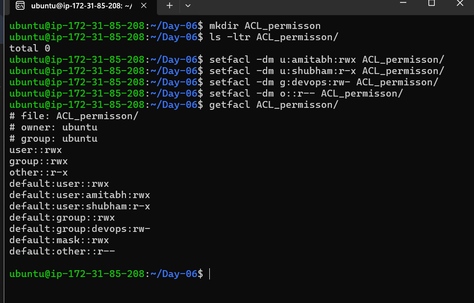

4. **Additional Tasks:**
   - **Task:** Create a script that changes the permissions of multiple files in a directory based on user input.

   **Answer**
  
  - creating permission dir and 10 text file to in it to change file permission at once : 

  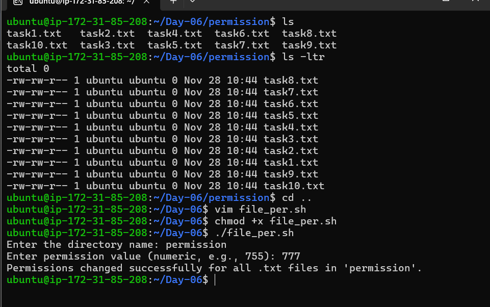


  file_per.sh : 
  ```bash
  #!/bin/bash

  <<Info
  Author      : Amitabh Soni
  Date        : 28/11/24
  Description : This script changes the permissions of all .txt files in a directory based on user input.
  Info

  # Prompting user for input
  read -p "Enter the directory name: " dir_name
  read -p "Enter permission value (numeric, e.g., 755): " num_value_per

  # Validate if the directory exists
  if [[ ! -d "$dir_name" ]]; then
    echo "Error: Directory '$dir_name' does not exist."
    exit 1
  fi

  # Check if .txt files exist in the directory
  txt_files=("$dir_name"/*.txt)
  if [[ ! -e "${txt_files[0]}" ]]; then
    echo "Error: No .txt files found in directory '$dir_name'."
    exit 1
  fi

  # Attempt to change file permissions for all .txt files
  sudo chmod "$num_value_per" "$dir_name"/*.txt

  # Checking the exit status
  if [[ $? -eq 0 ]]; then
    echo "Permissions changed successfully for all .txt files in '$dir_name'."
  else
    echo "Failed to change permissions for .txt files in '$dir_name'."
  fi
  ```


  - successfully change file permission through above script : 

  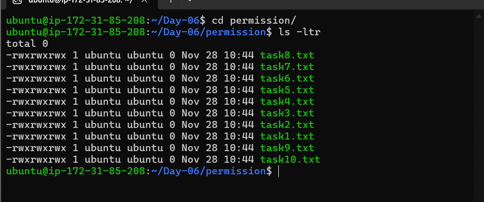


   - **Task:** Write a script that sets ACL permissions for a user on a given file, based on user input.

   **Answer**

   


   - acl_users_per.sh : 

  ```bash
  #!/bin/bash

  <<Info
  Author      : Amitabh Soni
  Date        : 28/11/24
  Description : This script sets ACL permissions for a user on a given file, based on user input.
  Info

  # Getting username
  read -p "Enter username: " user

  # Getting file path
  read -p "Enter a file path: " file_path

  # Getting permission for the user
  read -p "Enter the permission for user (e.g., rwx): " per

  # Validate if the file exists
  if [[ ! -e "$file_path" ]]; then
     echo "Error: File '$file_path' does not exist."
     exit 1
  fi

  # Setting ACL permission
  setfacl -m u:$user:$per "$file_path"

  # Checking the exit status of setfacl
  if [[ $? -eq 0 ]]; then
     echo "ACL permissions set successfully for user '$user' on file '$file_path'."
  else
     echo "Failed to set ACL permissions for user '$user' on file '$file_path'."
  fi
  ```

5. **Understanding Sticky Bit, SUID, and SGID:**
   - Read about sticky bit, SUID, and SGID.
     - Sticky bit: Used on directories to prevent users from deleting files they do not own.
     - SUID (Set User ID): Allows users to run an executable with the permissions of the executable's owner.
     - SGID (Set Group ID): Allows users to run an executable with the permissions of the executable's group.
   - Task: Create examples demonstrating the use of sticky bit, SUID, and SGID, and explain their significance.

   **Answer**
    - Sticky bit:

    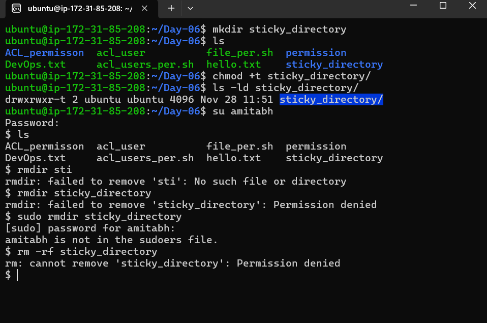

    - SUID:

        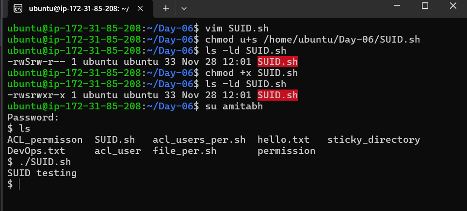

        - SUID.sh : 

        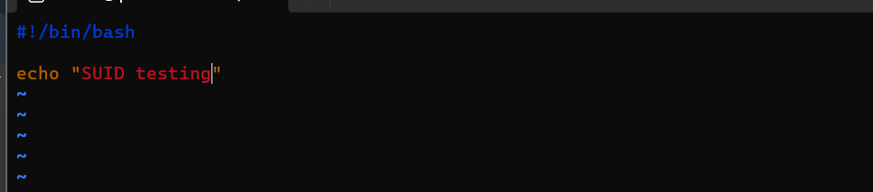

    - SGID:

    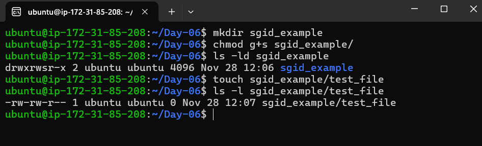
   

6. **Backup and Restore Permissions:**
  - Task: Create a script that backs up the current permissions of files in a directory to a file.

   **Answer**
   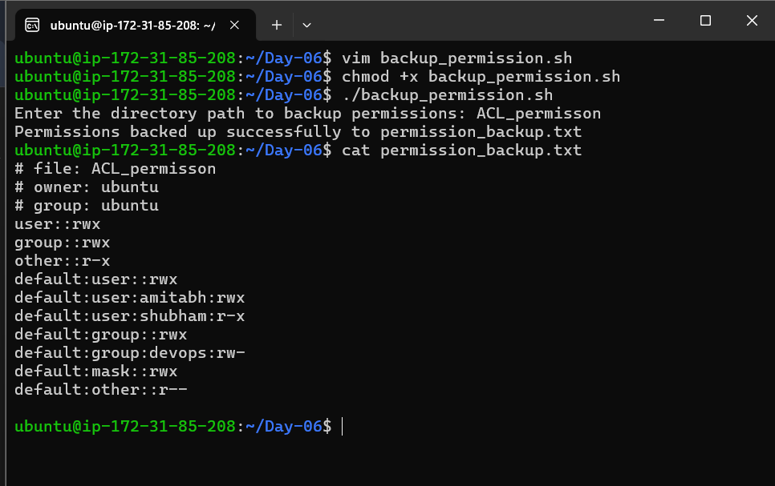


   backup_permission.sh : 

  ```bash
  #!/bin/bash

  <<Info
  Author      : Amitabh Soni
  Date        : 28/11/24
  Description : Creating a script that backs up the current permissions of files in a directory to a file.
  Info

  # Prompt user for the directory path
  read -p "Enter the directory path to backup permissions: " dir_path

  # Check if the directory exists
  if [[ ! -d "$dir_path" ]]; then
     echo "Error: The directory '$dir_path' does not exist."
     exit 1
  fi

  # Get and backup the ACL permissions recursively
  getfacl -R "$dir_path" > permission_backup.txt

  # Check if the command was successful
  if [[ $? -eq 0 ]]; then
     echo "Permissions backed up successfully to permission_backup.txt"
  else
     echo "Failed to backup permissions."
  fi
  ```


  - Task: Create another script that restores the permissions from the backup file.

   **Answer**
   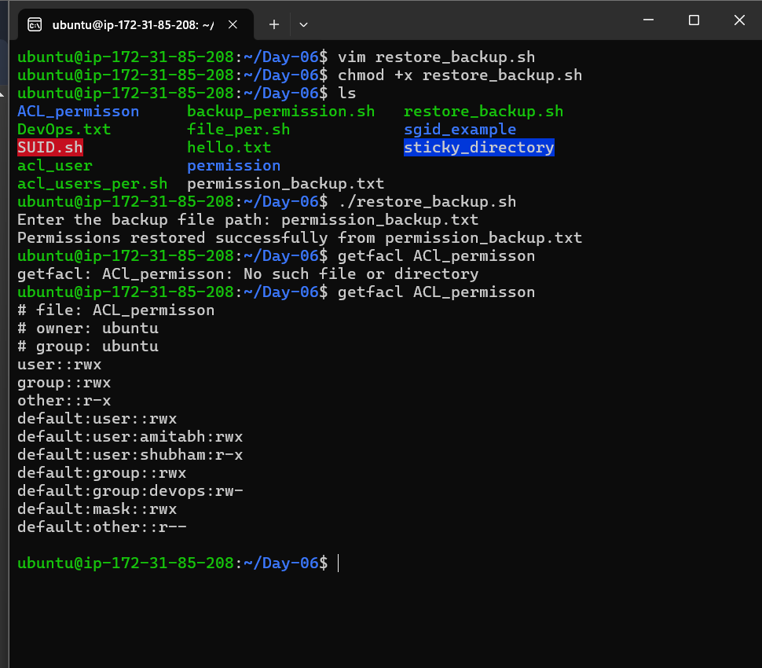


   restore_backup.sh : 

  ```bash
  #!/bin/bash

  <<Info
  Author      : Amitabh Soni
  Date        : 28/11/24
  Description : Script to restore file permissions from a backup file.
  Info

  # Prompt for the backup file path
  read -p "Enter the backup file path: " backup_file

  # Check if the backup file exists
  if [[ ! -f "$backup_file" ]]; then
     echo "Error: The backup file '$backup_file' does not exist."
     exit 1
  fi

  # Restore the file permissions using the backup file
  setfacl --restore="$backup_file"

  # Check if the command was successful
  if [[ $? -eq 0 ]]; then
     echo "Permissions restored successfully from $backup_file"
  else
     echo "Failed to restore permissions."
  fi
  ```

