# Day 7 Task: Understanding Package Manager and Systemctl

### What is a Package Manager in Linux?

In simpler words, a package manager is a tool that allows users to install, remove, upgrade, configure, and manage software packages on an operating system. The package manager can be a graphical application like a software center or a command line tool like apt-get or pacman.

You’ll often find me using the term ‘package’ in tutorials and articles. To understand a package manager, you must understand what a package is.

### What is a Package?

A package is usually referred to as an application but it could be a GUI application, command line tool, or a software library (required by other software programs). A package is essentially an archive file containing the binary executable, configuration file, and sometimes information about the dependencies.

### Different Kinds of Package Managers

Package managers differ based on the packaging system but the same packaging system may have more than one package manager.

For example, RPM has Yum and DNF package managers. For DEB, you have apt-get, aptitude command line-based package managers.

## Tasks

1. **Install Docker and Jenkins:**
   - Install Docker and Jenkins on your system from your terminal using package managers.

   - Docker installation proof :

      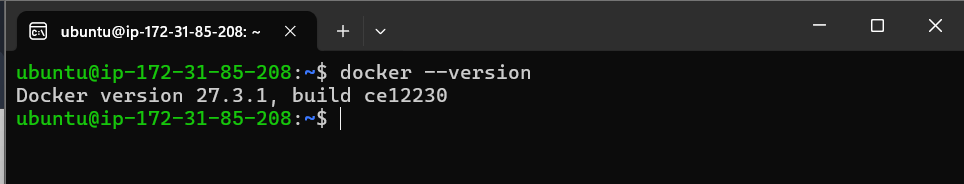

      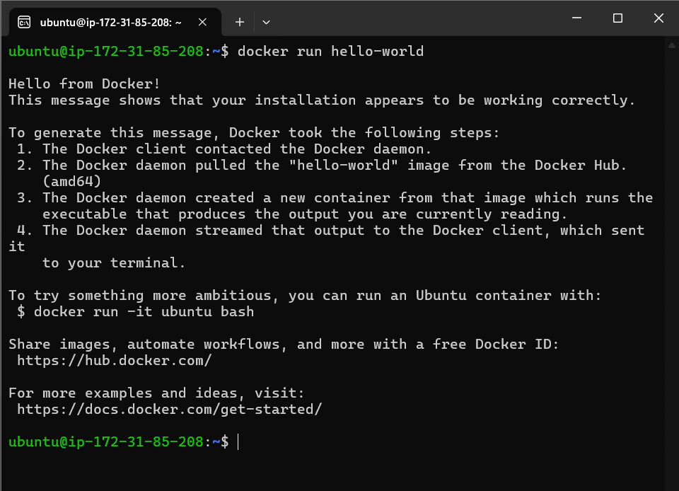

   - Jenkins installation proof : 

      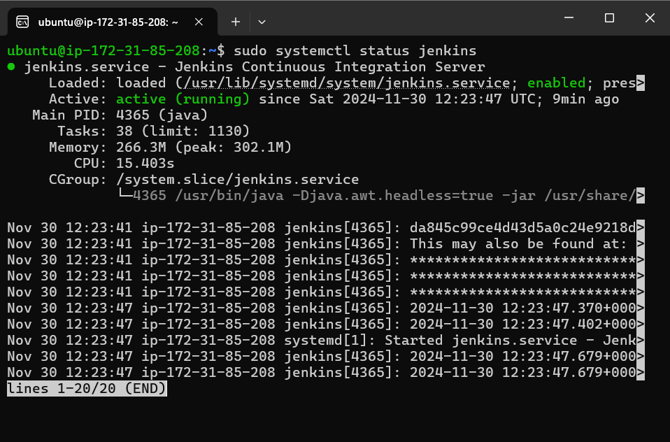

      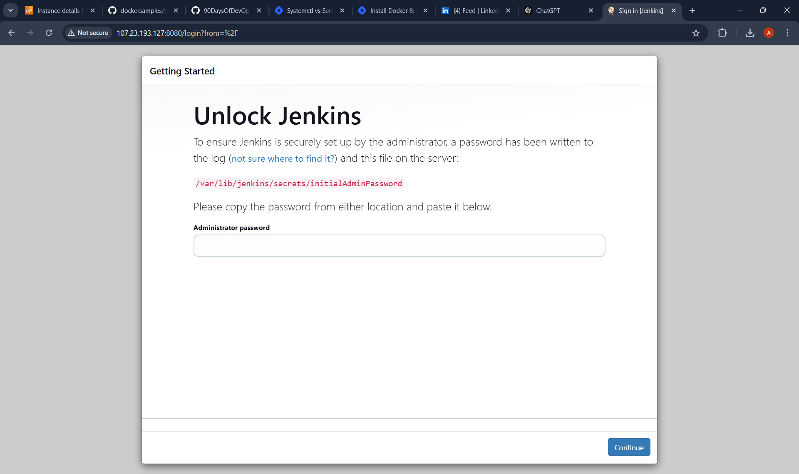

2. **Write a Blog or Article:**
   - Write a small blog or article on how to install these tools using package managers on Ubuntu and CentOS.

   - Checkout blog here : https://amitabhdevops.hashnode.dev/docker-and-jenkins-installation

### Systemctl and Systemd

Systemctl is used to examine and control the state of the “systemd” system and service manager. Systemd is a system and service manager for Unix-like operating systems (most distributions, but not all).


## Tasks

1. **Check Docker Service Status:**
   - Check the status of the Docker service on your system (ensure you have completed the installation tasks above).

   **Answer**

   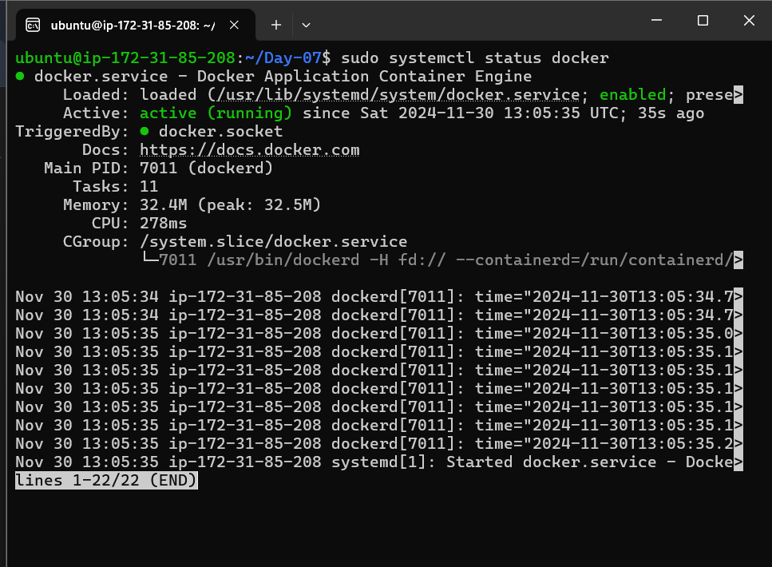

2. **Manage Jenkins Service:**
   - Stop the Jenkins service and post before and after screenshots.

   - Before stopping :

      


   - After stopping : 

      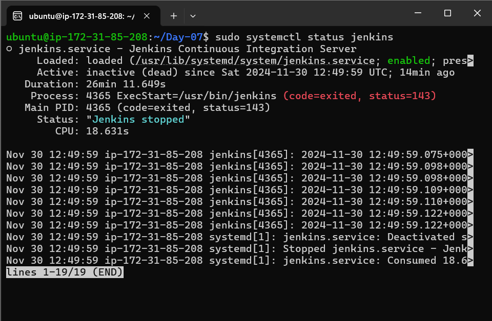


3. **Read About Systemctl vs. Service:**
   - Read about the differences between the `systemctl` and `service` commands.
   - Example: `systemctl status docker` vs. `service docker status`.

   **Answer**

   - For detail understanding of Systemctl and Service read this blog : https://amitabhdevops.hashnode.dev/understanding-the-differences-between-systemctl-and-service-commands-in-linux


### Additional Tasks

4. **Automate Service Management:**
   - Write a script to automate the starting and stopping of Docker and Jenkins services.

   - Stopped both Docker and Jenkins : 
   
      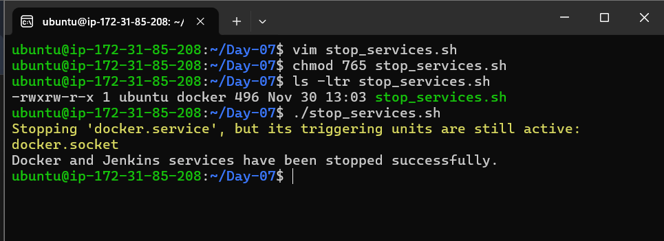

   - stop_services.sh : 

      ```bash
      #!/bin/bash

      <<Info
      Author : Amitabh Soni
      date : 30/11/24
      description : This script is used to automate the stopping of Docker and Jenkins services.
      Info

      # Stopping Docker service
      sudo systemctl stop docker

      # Stopping Jenkins service
      sudo systemctl stop jenkins

      # Checking if the previous commands ran successfully
      if [[ $? -eq 0 ]]; then
         echo "Docker and Jenkins services have been stopped successfully."
      else
         echo "An error occurred while stopping Docker and Jenkins services."
      fi
      ```

   - start_services.sh : 

      ```bash
      #!/bin/bash

      <<Info
      Author : Amitabh Soni
      date : 30/11/24
      description : This script is used to automate the starting of Docker and Jenkins services.
      Info

      # Starting Docker service
      sudo systemctl start docker

      # Starting Jenkins service
      sudo systemctl start jenkins

      # Checking if the previous commands ran successfully
      if [[ $? -eq 0 ]]; then
          echo "Docker and Jenkins services have been started successfully."
      else
          echo "An error occurred while starting Docker and Jenkins services."
      fi
      ```

   1. varifying Docker and jenkins services stopped or not : 
      
      - Docker : 

         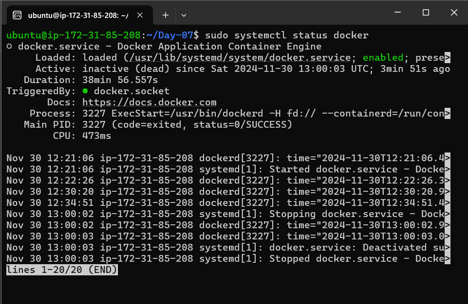

      - Jenkins : 

         

5. **Enable and Disable Services:**
   - Use systemctl to enable Docker to start on boot and disable Jenkins from starting on boot.

   **Answer**

    - Enable Docker to start on boot:

      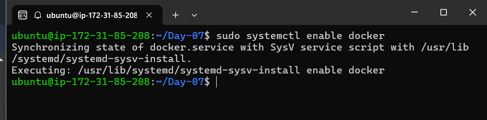

      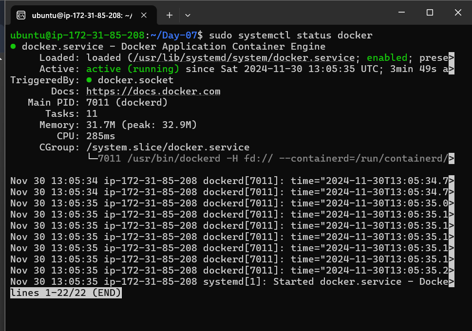


    - Disable Jenkins from starting on boot:

      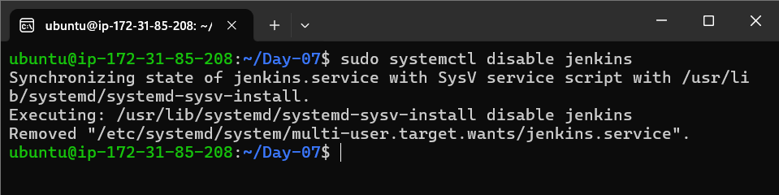

      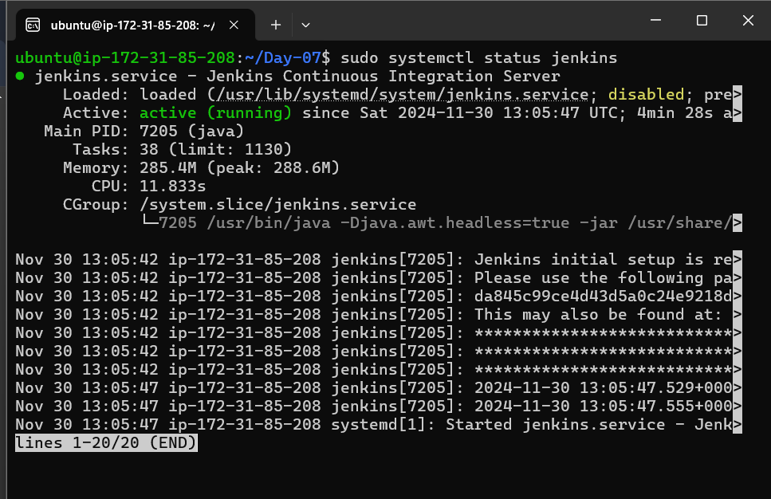


6. **Analyze Logs:**
   - Use journalctl to analyze the logs of the Docker and Jenkins services. Post your findings.

   **Answer**
    - Docker last 10 logs:

      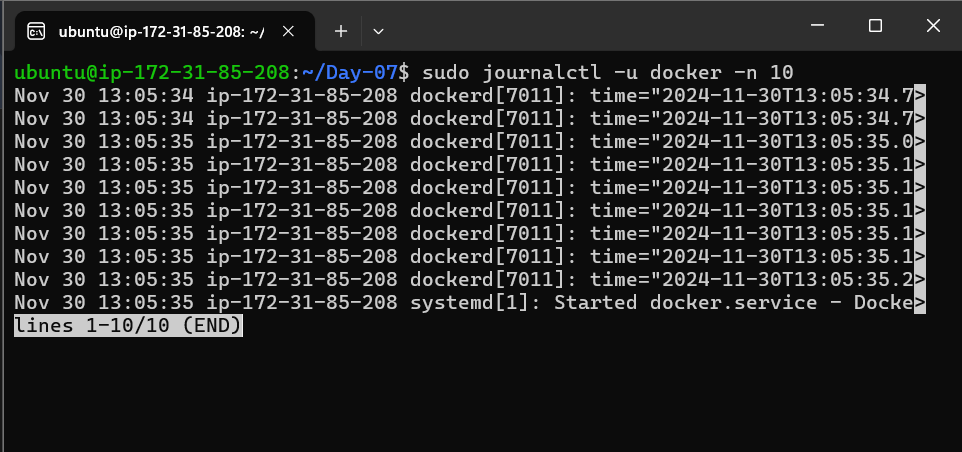

    - Jenkins last 10 logs:
   
      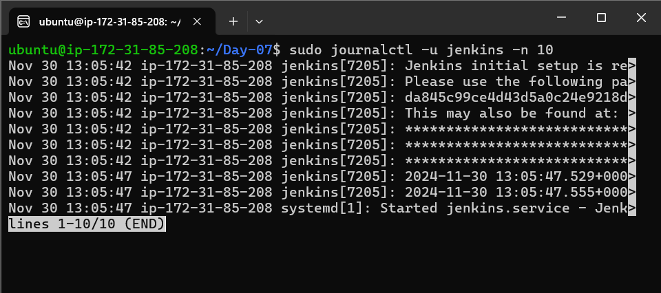
