# Day 8 Answers: Shell Scripting Challenge

## Tasks

1. **Comments**
   - In bash scripts, comments are used to add explanatory notes or disable certain lines of code. Your task is to create a bash script with comments explaining what the script does.

   **Answer**


      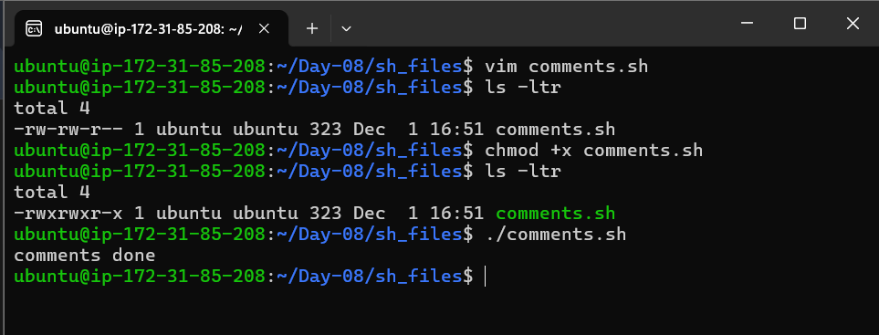

      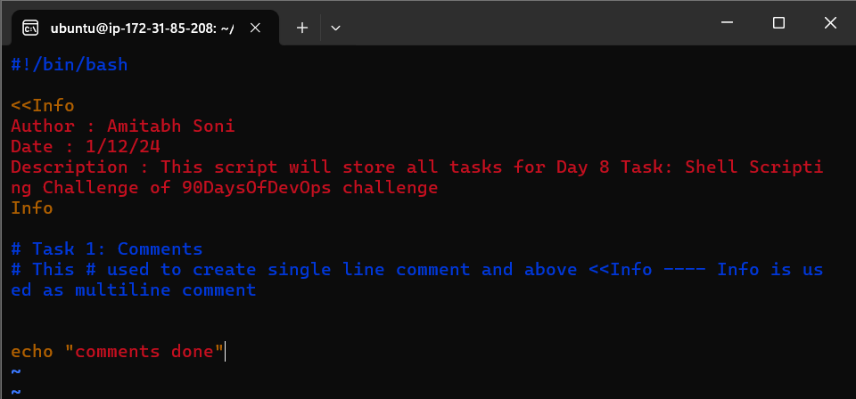


2. **Echo**
   - The echo command is used to display messages on the terminal. Your task is to create a bash script that uses echo to print a message of your choice.

   **Answer**


      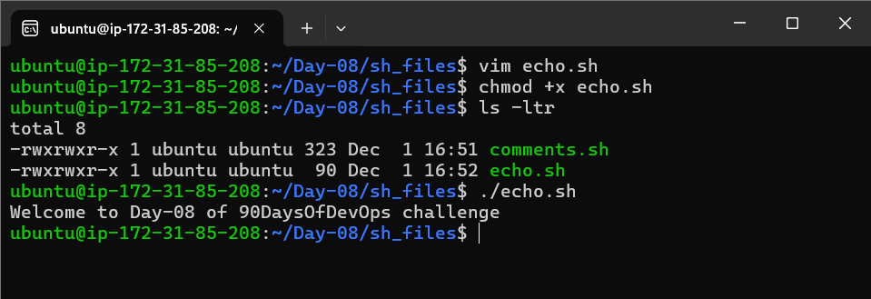

      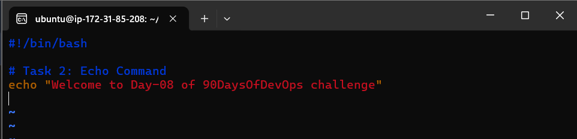


3. **Variables**
   - Variables in bash are used to store data and can be referenced by their name. Your task is to create a bash script that declares variables and assigns values to them.

   **Answer**


      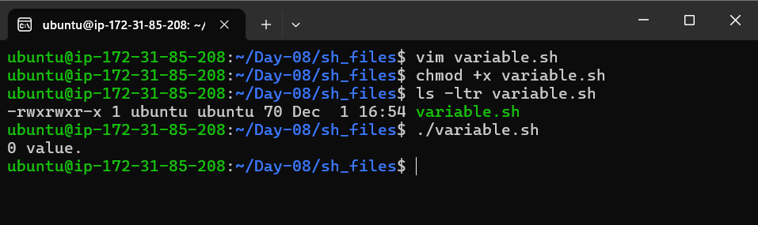

      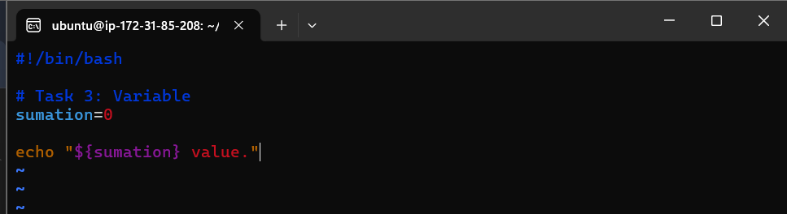


4. **Using Variables**
   - Now that you have declared variables, let's use them to perform a simple task. Create a bash script that takes two variables (numbers) as input and prints their sum using those variables.

   **Answer**


      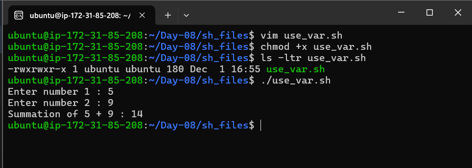

      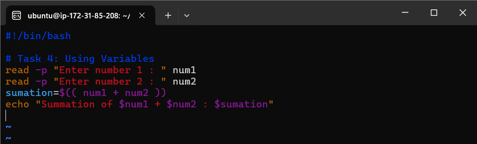  


5. **Using Built-in Variables**
   - Bash provides several built-in variables that hold useful information. Your task is to create a bash script that utilizes at least three different built-in variables to display relevant information.

   **Answer**


      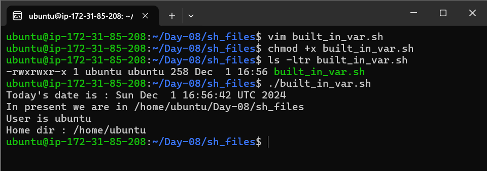

      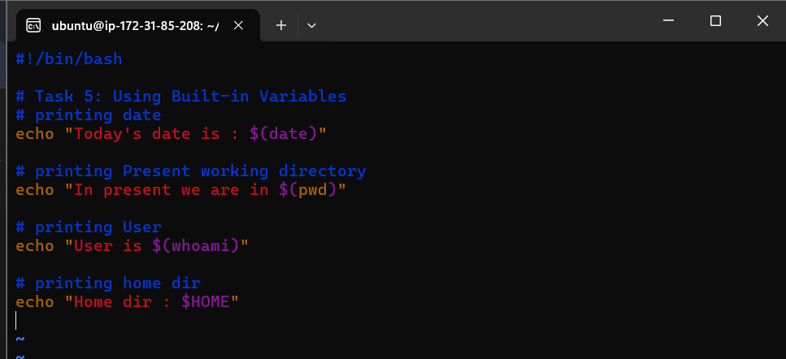     


6. **Wildcards**
   - Wildcards are special characters used to perform pattern matching when working with files. Your task is to create a bash script that utilizes wildcards to list all the files with a specific extension in a directory.

   **Answer**


      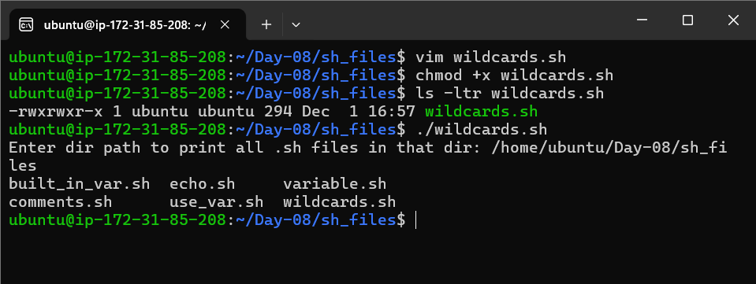

      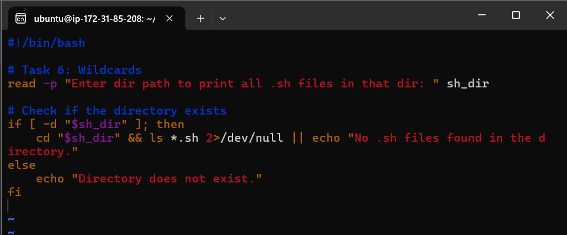     


7. **Whole script solution at once in a single script file**
   - day-08.sh : 
      
      ```bash
         #!/bin/bash

         <<Info
         Author : Amitabh Soni
         Date : 1/12/24
         Description : This script will store all tasks for Day 8 Task: Shell Scripting Challenge of 90DaysOfDevOps challenge
         Info

         # Task 1: Comments
         # This # is used to create a single-line comment.
         # The <<Info and Info are used for a multiline comment.


         # Task 2: Echo Command
         # The echo command is used to display text on the terminal.
         echo "Welcome to Day-08 of 90DaysOfDevOps challenge"


         # Task 3: Variable
         # Initializing a variable 'sumation' and setting its value to 0
         sumation=0


         # Task 4: Using Variables
         # The read command prompts the user to input a value.
         # The values entered by the user are stored in the variables num1 and num2.
         read -p "Enter number 1 : " num1
         read -p "Enter number 2 : " num2

         # Summing the two numbers entered by the user and storing the result in the 'sumation' variable.
         sumation=$(( num1 + num2 ))

         # Displaying the result of the summation.
         echo "Summation of $num1 + $num2 : $sumation"


         # Task 5: Using Built-in Variables
         # Using the built-in 'date' command to display the current date and time.
         echo "Today's date is : $(date)"

         # Using the 'pwd' command to display the current working directory.
         echo "In present we are in $(pwd)"

         # Using the 'whoami' command to display the current user logged in.
         echo "User is $(whoami)"

         # Using the built-in variable $HOME to display the current user's home directory.
         echo "Home dir : $HOME"


         # Task 6: Wildcards
         # The read command prompts the user to input a directory path.
         # Then the script changes to that directory and lists all files with the .sh extension using the 'ls' command and wildcard.
         read -p "Enter dir path to print all .sh files in that dir : " sh_dir
         cd ${sh_dir} && ls *.sh
      ```


      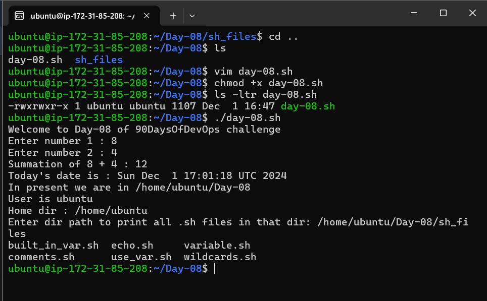

      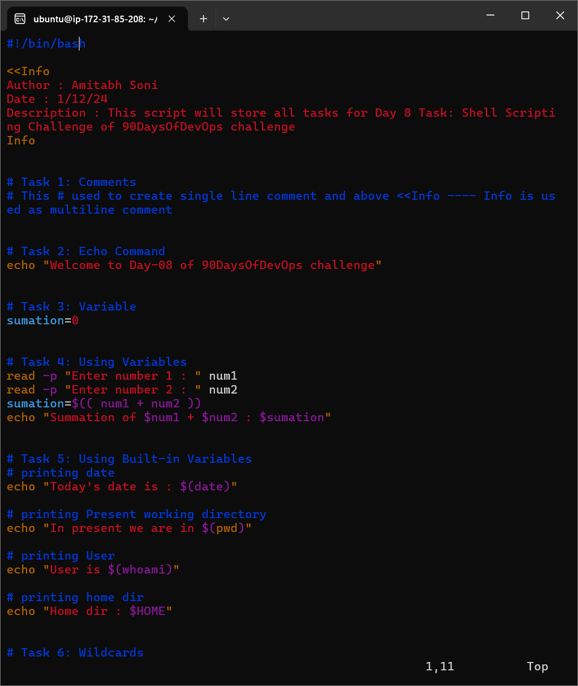


[LinkedIn](https://www.linkedin.com/in/amitabh-devops/)   
