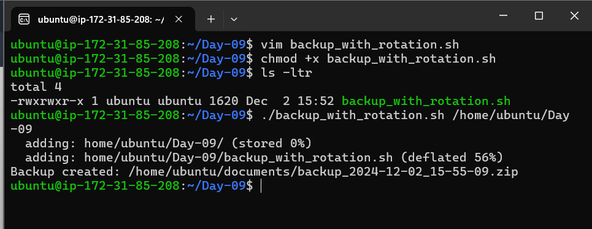
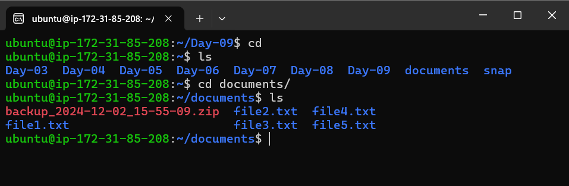
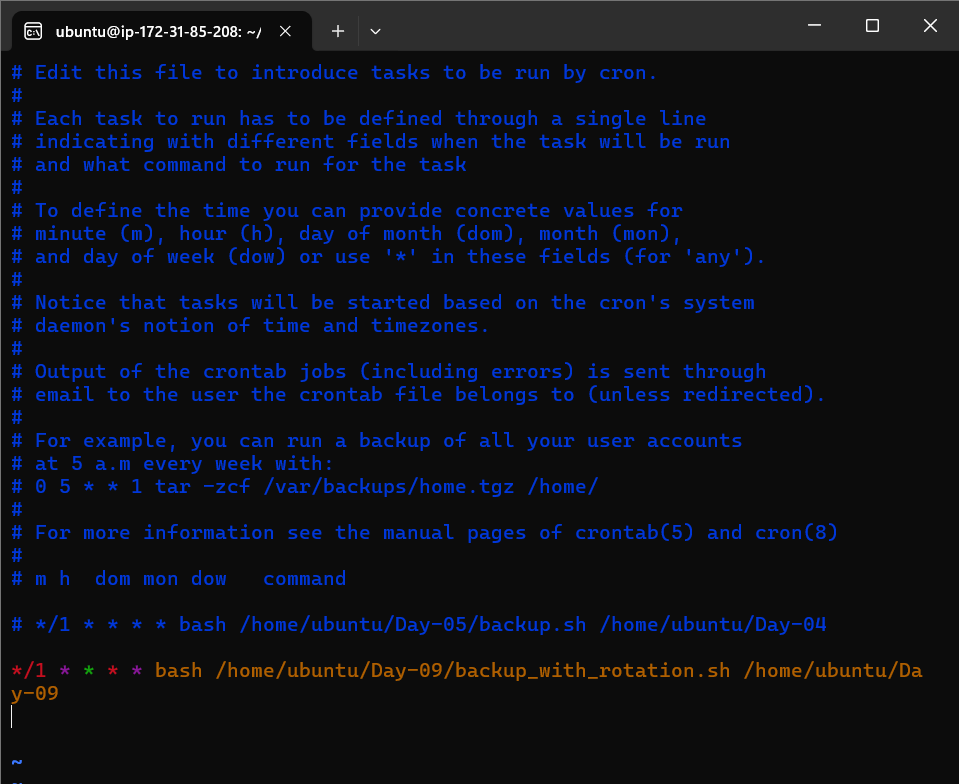
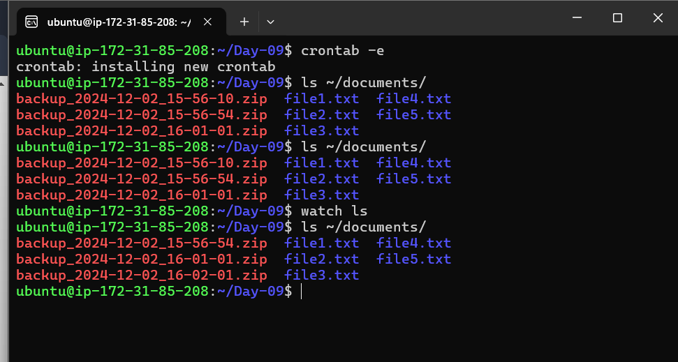

# Day-09 of #90DaysOfDevOps Backup with Rotation

## Introduction:

In this assignment, we will create a shell script that automatically takes backups of a specified directory and impl ements rotation to keep only the latest three backups. We'll also automate the backup process using a cron job.

## Hint:

To manage backups efficiently, you can use the following command to list files by modification date, skipping the first three:

```bash
ls -t | tail -n +4
```

This will list backups older than the latest three backups.

---

## Steps to Complete the Assignment

### 1\. Navigate to the Day-09 Directory

Ensure all your scripts are in the `Day-09` directory where you will create the backup script.

### 2\. Create a New Script File

In the `Day-09` directory, create a new script file called `backup_with_`[`rotation.sh`](http://rotation.sh) using the following command:

```bash
vim backup_with_rotation.sh
```

### 3\. Add the Backup Script Content

Below is the content of the `backup_with_`[`rotation.sh`](http://rotation.sh) script, which will handle both the backup creation and backup rotation:

#### `backup_with_`[`rotation.sh`](http://rotation.sh):

```bash
#!/bin/bash

<<info
Author: Amitabh Soni
Date: 08/11/2024 (DD:MM:YYYY)
Description: This shell script will take a backup with rotation, storing only the 3 latest backup files of a 'Day-09' directory in the /home/ubuntu/documents destination.
info

# Function to create a backup
function create_backup() {
    # Timestamp for backup naming
    timestamp=$(date '+%Y-%m-%d_%H-%M-%S')

    # Target directory where backups are stored
    target_dir="/home/ubuntu/documents"

    # Backup filename
    backup_file="${target_dir}/backup_${timestamp}.zip"

    # Create zip backup
    zip -r "$backup_file" "$1"

    if [ $? -eq 0 ]; then
        echo "Backup created: ${backup_file}"
    else
        echo "Error: Failed to create backup."
        return 1
    fi
}

# Function to rotate backups, keeping only the 3 latest ones
function rotate_backups() {
    # Directory containing backups
    target_dir="/home/ubuntu/documents"

    if [[ -d $target_dir ]]; then
        cd "$target_dir"

        # List all zip files by modification date (most recent first), then skip the first 3
        old_backups=$(ls -t *.zip | tail -n +4)

        # Remove each old backup file
        for file in $old_backups; do
            echo "Deleting old backup: $file"
            rm -f "$file"
        done
    else
        echo "Error: Target directory $target_dir does not exist."
        return 1
    fi
}

# Run the backup function with the specified directory as an argument
create_backup "$1"

# Call rotate_backups function to manage backup rotation
rotate_backups
```

---

### 4\. Make the Script Executable

Once you’ve created the script, you need to make it executable. Use the following command:

```bash
chmod +x backup_with_rotation.sh
```

### 5\. Run the Script with Directory Argument

Run the script by passing the directory you want to back up as an argument. For example, to back up the `Day-09` directory, use the following command:

```bash
./backup_with_rotation.sh /home/ubuntu/Day-09
```



### 6\. Verify Backup Creation

After running the script, a backup file will be created in the `/home/ubuntu/documents` directory. You can verify it using the command `ls /home/ubuntu/documents`.



---

## Automating the Backup with Cron Jobs

Now that we've successfully created the backup script, let's automate the process using a cron job. This way, the backup process will run automatically at scheduled intervals.

### 7\. Edit Crontab to Schedule the Backup

To set up a cron job, open the crontab editor with the following command:

```bash
crontab -e
```

### 8\. Schedule the Backup Script

I scheduled the script to run every minute to test the automation. Add the following line to the crontab file:

```bash
*/1 * * * * bash /home/ubuntu/Day-09/backup_with_rotation.sh /home/ubuntu/Day-09 
```




### 9\. Verify the Cron Job Execution

After setting up the cron job, the backup will be created automatically. To verify that the cron job is working, you can watch the changes in the `/home/ubuntu/documents` directory using the `watch` command.

#### Video showing the cron job execution:

%[https://youtu.be/S5Ih838e_hY] 

### 10\. Confirm Backup Updates

You can also confirm that the backup is being updated automatically by checking the contents of the `/home/ubuntu/documents` directory.



---

## Conclusion

In this assignment, we've created a shell script that takes backups of a specified directory, implements backup rotation to keep only the latest three backups, and automates the entire process using cron jobs. The solution ensures that backups are taken periodically and that older backups are cleaned up to save space.