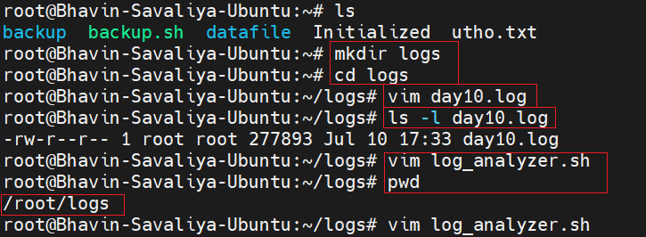

# Day 10 Task: Log Analyzer and Report Generator

## Challenge Title: Log Analyzer and Report Generator

## Scenario

You are a system administrator responsible for managing a network of servers. Every day, a log file is generated on each server containing important system events and error messages. As part of your daily tasks, you need to analyze these log files, identify specific events, and generate a summary report.

## Task

Write a Bash script that automates the process of analyzing log files and generating a daily summary report. The script should perform the following steps:


- log_analyzer.sh :

   ```bash
   
   #!/bin/bash

   <<Info
   Author       : Amitabh Soni
   Date         : 5/12/2024
   Description  : This script analyzes a log file and generates a summary report. It counts errors, finds critical events,
                     identifies the top 5 most common errors, and creates a summary report. Optionally, it archives the log file.
   Usage        : ./log_analyzer.sh <log_file_path>
   Info

   # Function to check input arguments
   validate_input() {
      if [[ $# -ne 1 ]]; then
       echo "Usage: $0 <log_file_path>"
       exit 1
      fi

      log_file=$1

      if [[ ! -f $log_file || ! -r $log_file ]]; then
       echo "Error: File '$log_file' does not exist or is not readable."
       exit 1
      fi
   }

   # Function to count total lines in the log file
   count_total_lines() {
      wc -l < "$log_file"
   }

   # Function to count total errors
   count_total_errors() {
      grep -i -c "error" "$log_file"
   }

   # Function to find critical events
   find_critical_events() {
      awk '/CRITICAL/ {print NR, $0}' "$log_file"
   }

   # Function to find top 5 most common error messages
   find_top_errors() {
      grep -i "error" "$log_file" | \
      awk '{$1=$2=$3=""; print $0}' | \
      sort | uniq -c | sort -nr | head -n 5
   }

   # Function to generate the summary report
   generate_report() {
      echo "Log Analysis Report" > "$report_file"
      echo "--------------------" >> "$report_file"
      echo "Date of Analysis: $(date +'%Y-%m-%d_%H:%M:%S')" >> "$report_file"
      echo "Log File: $log_file" >> "$report_file"
      echo "Total Lines Processed: $total_lines" >> "$report_file"
      echo "Total Error Count: $error_count" >> "$report_file"
      echo "Critical Events:" >> "$report_file"
      find_critical_events >> "$report_file"
      echo "Top 5 Most Common Error Messages:" >> "$report_file"
      find_top_errors >> "$report_file"
   }

   # Function to archive the log file
   archive_log_file() {
      mkdir -p "$archive_dir"
      mv "$log_file" "$archive_dir/" && \
      echo "Log file has been archived to $archive_dir/"
   }

   # Main script execution starts here
   validate_input "$@"

   log_file=$1

   # Extract the base name of the log file (without the path) for unique report naming
   log_file_basename=$(basename "$log_file" | sed 's/\..*$//') # Removes the extension for cleaner naming
   timestamp=$(date +'%Y%m%d_%H%M%S')                          # Generate a timestamp
   report_file="log_analysis_${log_file_basename}_${timestamp}.txt" # Unique report file name
   archive_dir="./archived_logs"

   total_lines=$(count_total_lines)
   error_count=$(count_total_errors)

   generate_report
   archive_log_file

   echo "Log analysis completed. Report saved to $report_file."

   ```


1. **Input:** The script should take the path to the log file as a command-line argument.


2. **Error Count:** Analyze the log file and count the number of error messages. An error message can be identified by a specific keyword (e.g., "ERROR" or "Failed"). Print the total error count.

   - 


3. **Critical Events:** Search for lines containing the keyword "CRITICAL" and print those lines along with the line number.

   - 

   - hence there is nothing keyword like "CRITICAL" , that's why it doesn't show here.


4. **Top Error Messages:** Identify the top 5 most common error messages and display them along with their occurrence count.

   - 


5. **Summary Report:** Generate a summary report in a separate text file. The report should include:
   - Date of analysis
   - Log file name
   - Total lines processed
   - Total error count
   - Top 5 error messages with their occurrence count
   - List of critical events with line numbers

   - 


6. **Optional Enhancement:** Add a feature to automatically archive or move processed log files to a designated directory after analysis.

   - Archieve working image : 

      


7. **Outputs images :**

   - Created log_analyzer.sh to create script for task :

      


   - Running that script with arguments : 

      


   - Varifying txt file where the summary has been created : 
      
      


   - Checking archive dir to varify it works or not :

      


## Sample Log File

A sample log file named `sample_log.log` has been provided in the same directory as this challenge file. You can use this file to test your script or use [this](https://github.com/logpai/loghub/blob/master/Zookeeper/Zookeeper_2k.log)

- To get this log file into your system used comamnd : `wget https://raw.githubusercontent.com/logpai/loghub/master/Zookeeper/Zookeeper_2k.log`

- which only download github file content.

   


[LinkedIn](https://www.linkedin.com/in/amitabh-devops/)
