# Day 11 Task: Error Handling in Shell Scripting

## Learning Objectives
Understanding how to handle errors in shell scripts is crucial for creating robust and reliable scripts. Today, you'll learn how to use various techniques to handle errors effectively in your bash scripts.

## Topics to Cover
1. **Understanding Exit Status**: Every command returns an exit status (0 for success and non-zero for failure). Learn how to check and use exit statuses.
2. **Using `if` Statements for Error Checking**: Learn how to use `if` statements to handle errors.
3. **Using `trap` for Cleanup**: Understand how to use the `trap` command to handle unexpected errors and perform cleanup.
4. **Redirecting Errors**: Learn how to redirect errors to a file or `/dev/null`.
5. **Creating Custom Error Messages**: Understand how to create meaningful error messages for debugging and user information.

## Tasks

### Task 1: Checking Exit Status
- Write a script that attempts to create a directory and checks if the command was successful. If not, print an error message.

### Task 1: Checking Exit Status

- `check_exit.sh`:

  ```bash
  #!/bin/bash

  <<Info
  Author      : Amitabh Soni
  Date        : 6/12/24
  Description : This script attempts to create a directory and checks if the command was successful. If not, it prints an error message.
  Info

  # Creating directory
  mkdir -p task1

  # Checking if the previous command got executed or not
  if [[ $? -eq 0 ]]; then
      echo "Directory 'task1' successfully created."
  else
      echo "ERROR: Failed to create directory 'task1'. Please check your permissions or try again."
  fi
  ```

- shell script written : 

  


- running script : 

  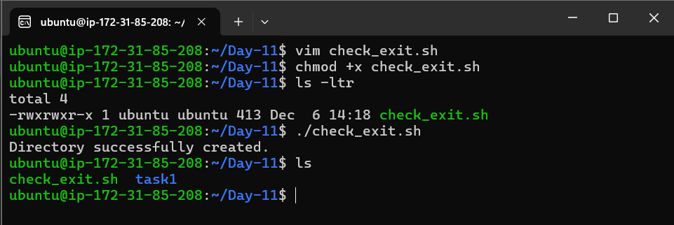


- running it again to check whether it cause error or not , works properly or not.

  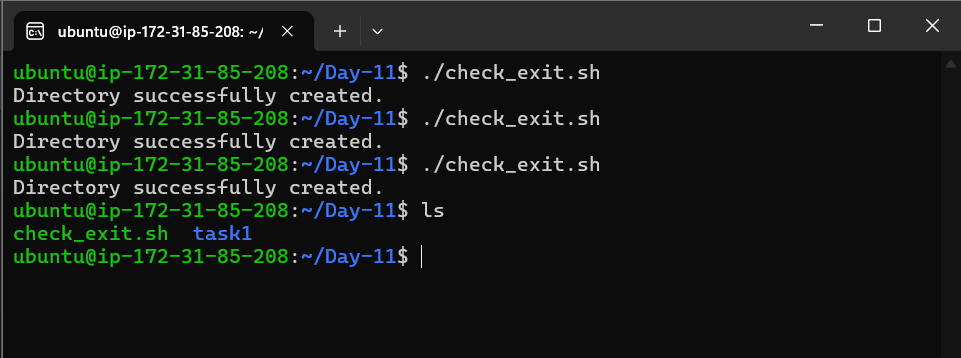


### Task 2: Using `if` Statements for Error Checking
- Modify the script from Task 1 to include more commands (e.g., creating a file inside the directory) and use `if` statements to handle errors at each step.

- updated `check_exit.sh`:

  ```bash
  #!/bin/bash

  <<Info
  Author      : Amitabh Soni
  Date        : 6/12/24
  Description : This is a script that attempts to create a directory and checks if the command was successful. If not, print an error message.
  Info

  # Task 1
  # Creating directory
  mkdir -p task1

  # Checking if the previous command got executed or not
  if [[ $? -eq 0 ]]; then
      echo "Directory 'task1' successfully created."
  else
      echo "ERROR: Failed to create directory 'task1'. Please check your permissions or try again."
  fi

  # Task 2
  # Checking if directory 'task1' exists
  if [[ -d task1 ]]; then

      # Checking if file already exists
      if [[ -f task1/task1.txt ]]; then
          echo "File 'task1.txt' already exists in 'task1'."
      else

          # Create the file if it does not exist
          touch task1/task1.txt

          if [[ $? -eq 0 ]]; then
              echo "File 'task1.txt' successfully created in 'task1'."
          else
              echo "ERROR: Failed to create file 'task1.txt' in 'task1'."
          fi
      fi
  else
      echo "ERROR: Directory 'task1' does not exist. Cannot create file."
  fi
  ```


- shell script written : 

  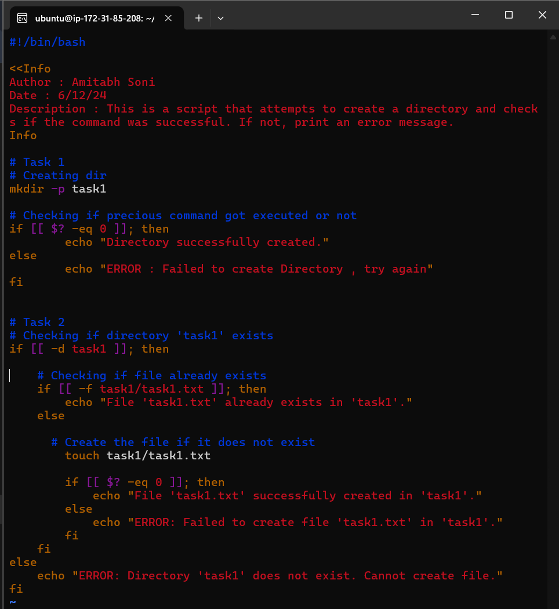


- running script : 

  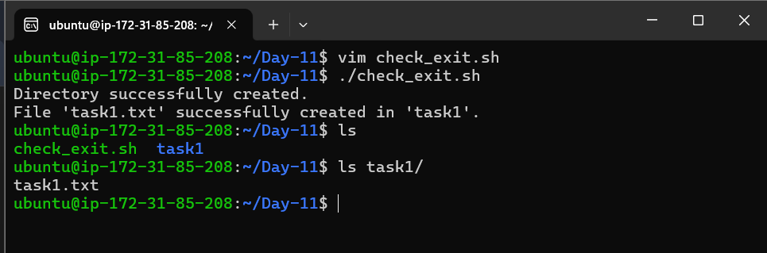


- running it again to check whether it(script if statement for file exist) works properly or not.

  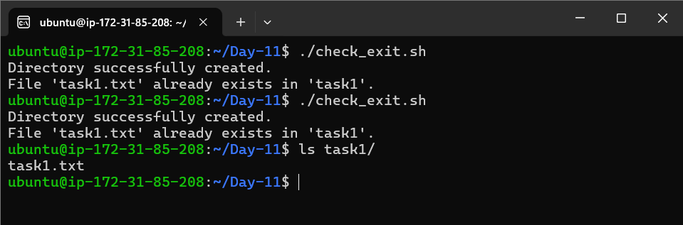


### Task 3: Using `trap` for Cleanup
- Write a script that creates a temporary file and sets a `trap` to delete the file if the script exits unexpectedly.

### Task 3: Using `trap` for Cleanup
- Write a script that creates a temporary file and sets a `trap` to delete the file if the script exits unexpectedly.

- `trap_cleanup.sh`:

  ```bash
  #!/bin/bash

  <<Info
  Author      : Amitabh Soni
  Date        : 6/12/24
  Description : This script creates a temporary file and sets a trap to delete the file if the script exits unexpectedly.
  Info

  # Create a temporary directory
  mkdir -p tmp

  # Create a temporary file inside the directory
  touch tmp/temp1.txt
  echo "This is a temporary file." > tmp/temp1.txt

  # Set a trap to delete the temporary file if the script exits unexpectedly (due to an error)
  trap "rm -f tmp/temp1.txt; echo 'Temporary file deleted due to error.'" ERR

  # Simulate script work here
  echo "Script is running. The temporary file has been created."

  # Uncomment the next line to simulate an error and test the trap
  # invalid_command  # This will trigger an error and activate the trap

  # Check the exit status of the previous command to decide what happens next
  if [[ $? -ne 0 ]]; then
      # Error occurred, file has been deleted by the trap
      echo "An error occurred, script exiting."
  else
      # No error, continue execution
      echo "Script completed successfully. Temporary file will not be deleted."
  fi
  ```

- Before causing error :

  - shell script written : 

    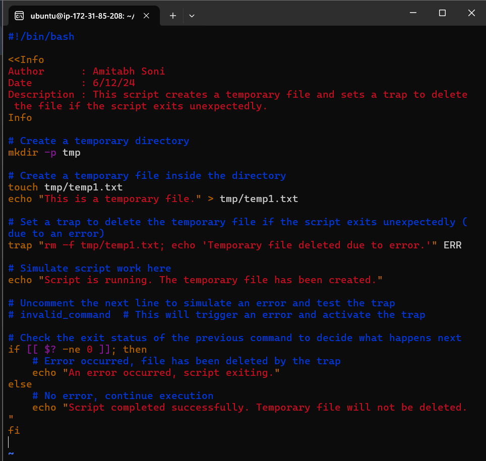


  - running script : 

    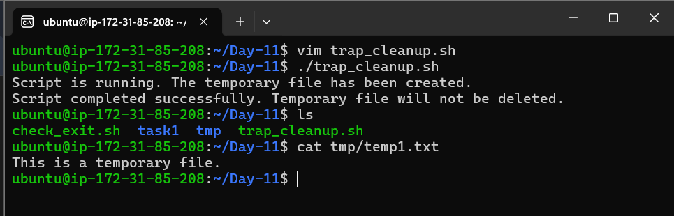


  - running it again to check whether it cause error or not , works properly or not.

    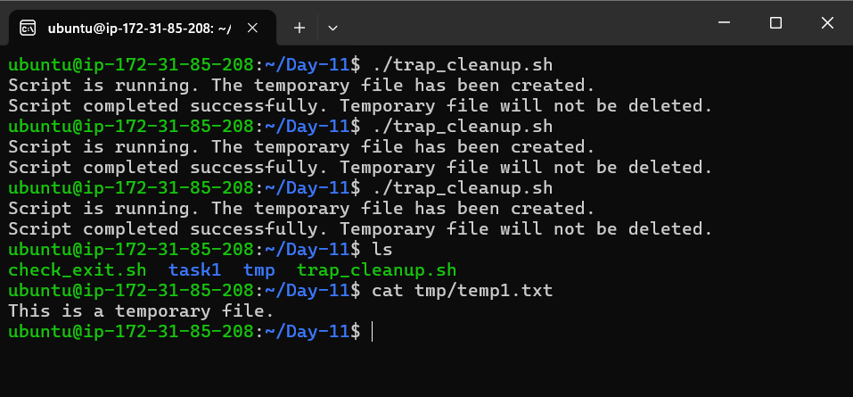


- After causing error through un-commenting `# invalid_command` in shell script : 

  - shell script written with error to check its working: 

    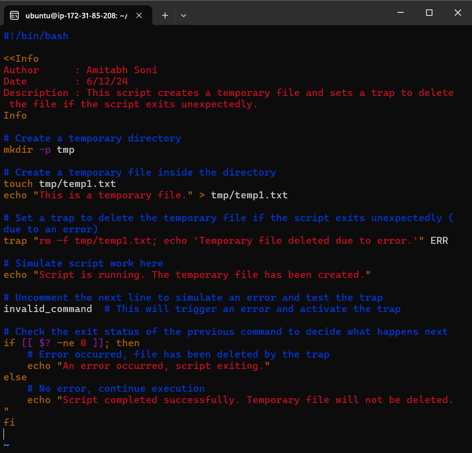


  - running script which works correctly according to task: 

    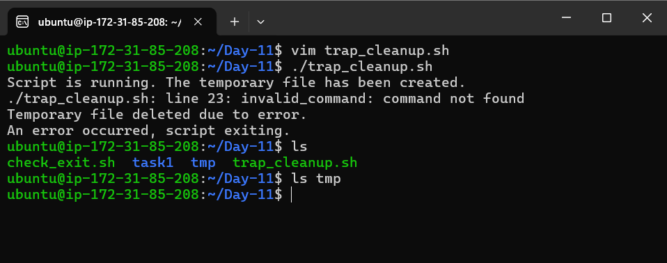


### Task 4: Redirecting Errors
- Write a script that tries to read a non-existent file and redirects the error message to a file called `error.log`.

- `redirect_error.sh`:

  ```bash
  #!/bin/bash

  <<Info
  Author      : Amitabh Soni
  Date        : 6/12/24
  Description : This script attempts to read a non-existent file and redirects the error message to a file called error.log.
  Info

  # Attempting to read a non-existent file
  cat non_existent_file.txt 2> error.log

  # Checking if error.log has been created and displaying the error message
  if [[ -f error.log ]]; then
      echo "Error has been logged to error.log"
  else
      echo "No error occurred."
  fi
  ```


- shell script written : 

  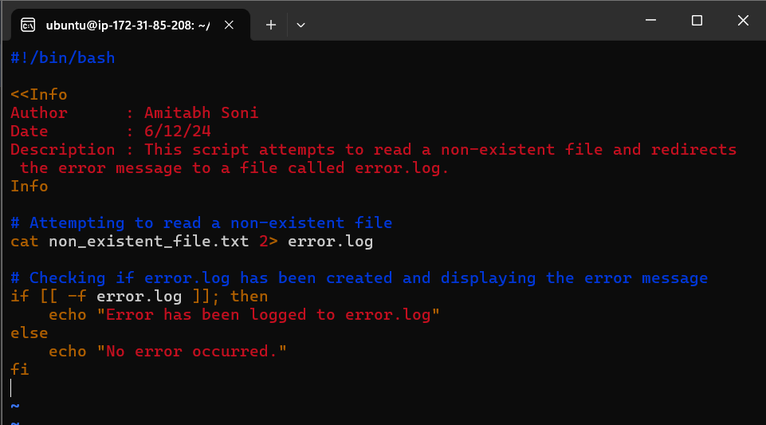


- Output image : 

  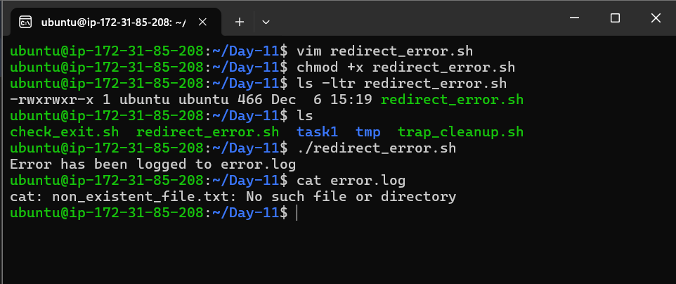


### Task 5: Creating Custom Error Messages
- Modify one of the previous scripts to include custom error messages that provide more context about what went wrong.

- Updated `redirect_error.sh` : 

  ```bash
  #!/bin/bash

  <<Info
  Author      : Amitabh Soni
  Date        : 6/12/24
  Description : This script attempts to read a non-existent file and redirects the error message to a file called error.log with custom error messages.
  Info

  # Attempting to read a non-existent file
  echo "Attempting to read a non-existent file: non_existent_file.txt"
  cat non_existent_file.txt 2> error.log

  # Custom error message for failure
  if [[ -f error.log ]]; then
      echo "Custom Error Message: The file 'non_existent_file.txt' does not exist or cannot be read." >> error.log
      echo "The error has been logged to error.log with more context."
  else
      echo "No error occurred."
  fi
  ```

- shell script written : 

  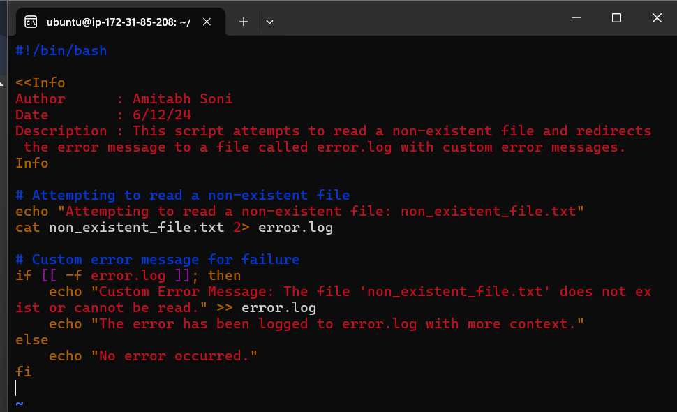


- Output image with custom ERROR message : 

  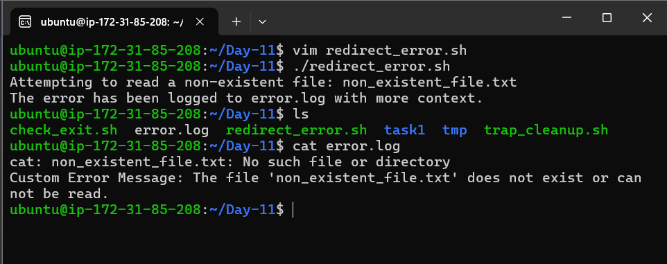


[Linkedin](https://linkedin.com/in/amitabh-devops)