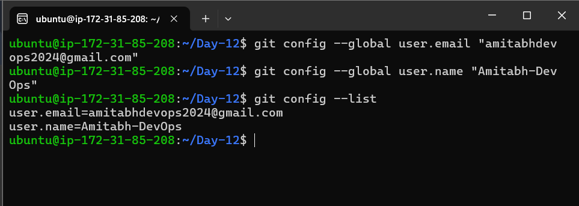
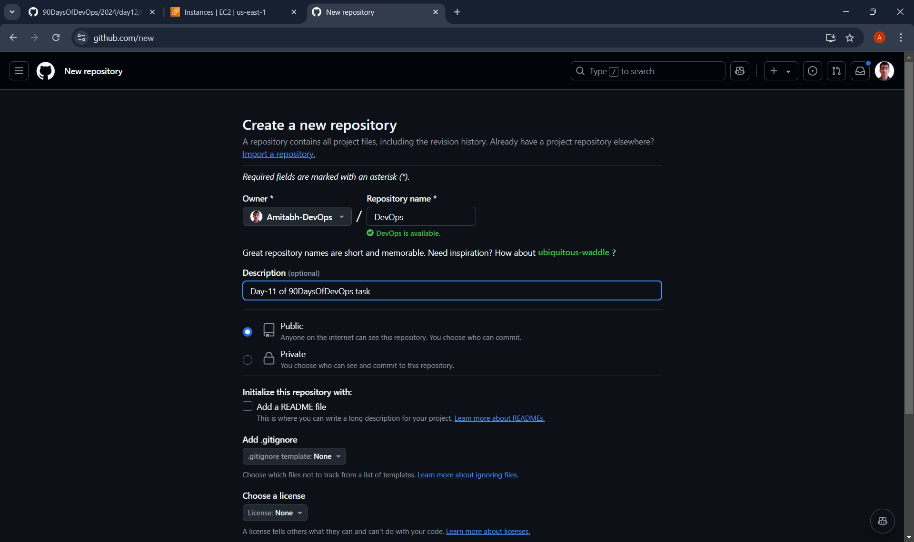
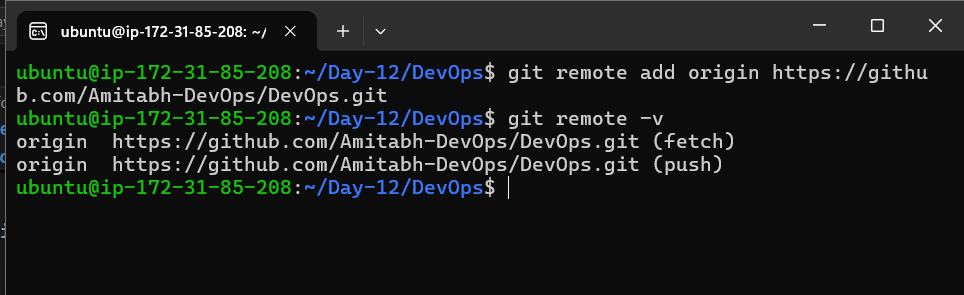
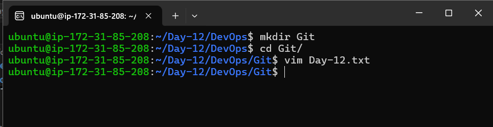
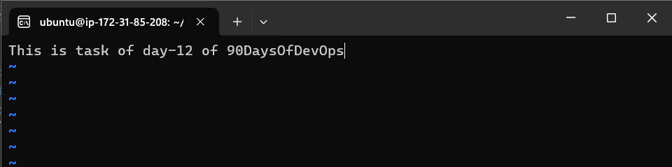
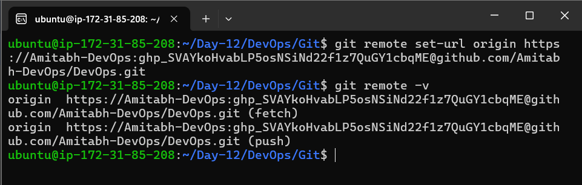
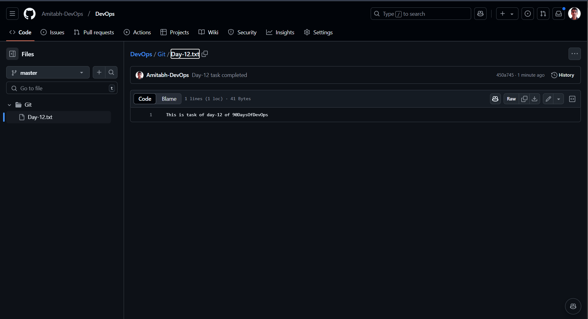

# Day 12 Task: Deep Dive in Git & GitHub for DevOps Engineers

## Find the answers by your understandings (Shouldn't be copied from the internet & use hand-made diagrams) of the questions below and write a blog on it.

1. What is Git and why is it important?

**Answer :**

  - What is Git:

    **Git** is a distributed version control system, used to manage version of application during the developement of applications.

  - why Git is important:

    1. **Distributed** : It is distributed version control system, which mean every developer have copy of source code ,they can even work if the github server is down or code is not accessiable due to any issue. change can be made offline.

    2. **Collaboration** : It allows developers to copy source code of public repositary and make changes to it , to add or update features to it , which evolues new opportunity for developers to contribute accross overall world.

    3. **version history** : Git tracks all changes made to a codebase, allowing developers to roll back to a previous version if needed.

    4. **branching and merging** : It allow to developers to copy production code and without touching production code they even can made changes through creating seperate branch ,which copies all the code to that branch, which helps to avoid any issues. if we made changes directly to production code it can be create issues ,so to avoid it we use branches which helps to test new features and any update to applications.

2. What is the difference between Main Branch and Master Branch?

**Answer :**

  - **Master Branch** : The original default branch in Git, representing the primary line of development.

  - **Main Branch** : A more modern and inclusive term used as the default branch name for new repositories, serving the same function as the master branch.

3. Can you explain the difference between Git and GitHub?

**Answer :**

  - **Git** : Git is a version control system which allows developers to manage and create their repositories, commits, branches, and merges locally

  - **Github** : Github is also version control system which uses Git in background , it provide Web interface to create and manage Git repositories ,even it adds features for collaboration, such as pull requests, issue tracking, and code reviews. 

4. How do you create a new repository on GitHub?

**Answer :**

  Creating a new repository on GitHub involves the following steps:

  1. **Log in to GitHub:** Open GitHub and log in with your credentials.

  2. **Create a New Repository:**
     - On the GitHub homepage, click the `+` button in the top-right corner and select `New repository`.
     - Alternatively, you can go to [https://github.com/new](https://github.com/new).

  3. **Fill in Repository Details:**
     - **Repository Name:** Choose a name for your repository (e.g., `my-first-repo`).
     - **Description:** Optionally, add a short description of your repository.
     - **Visibility:** Choose whether the repository will be public or private.
     - **Initialize with a README:** Optionally, check the box to add a README file to the repository.

  4. **Create Repository:** Click the `Create repository` button to finalize the process.

5. What is the difference between a local & remote repository? How to connect local to remote?

**Answer :**

  - **Local Repository** : A local repository is stored on our(developers) own computer. It contains our code and version history, but it's only accessible to us unless we share it.

  - **Remote Repository** : A remote repository is hosted on a server (e.g., GitHub, GitLab, Bitbucket). It acts as a central hub where multiple developers can push and pull changes.

## Tasks

### Task 1:
- Set your user name and email address, which will be associated with your commits.

- Output image : 

  

### Task 2:
- Create a repository named "DevOps" on GitHub.

  

- Connect your local repository to the repository on GitHub.

  

- Create a new file in Devops/Git/Day-02.txt & add some content to it.

  

  

- Push your local commits to the repository on GitHub.

  - remote url-setup : 

    

  - pushing code to Github : 

    

  - Github repo Output : 

    

[Linkedin](https://linkedin.com/in/amitabh-devops)
