# Day 13 Task: Advance Git & GitHub for DevOps Engineers

## Git Branching

Branches are a core concept in Git that allow you to isolate development work without affecting other parts of your repository. Each repository has one default branch, and can have multiple other branches. You can merge a branch into another branch using a pull request.

Branches let you develop features, fix bugs, or safely experiment with new ideas in a contained area of your repository.

## Git Revert and Reset

Git reset and git revert are two commonly used commands that allow you to remove or edit changes you’ve made in the code in previous commits. Both commands can be very useful in different scenarios.

## Git Rebase and Merge

### What Is Git Rebase?

Git rebase is a command that lets users integrate changes from one branch to another, and the commit history is modified once the action is complete. Git rebase helps keep a clean project history.

### What Is Git Merge?

Git merge is a command that allows developers to merge Git branches while keeping the logs of commits on branches intact. Even though merging and rebasing do similar things, they handle commit logs differently.

For a better understanding of Git Rebase and Merge, check out this [article](https://www.simplilearn.com/git-rebase-vs-merge-article).

## Tasks

### Task 1: Feature Development with Branches

1. **Create a Branch and Add a Feature:**
   - Add a text file called `version01.txt` inside the `Devops/Git/` directory with “This is the first feature of our application” written inside.  

      Output : 

        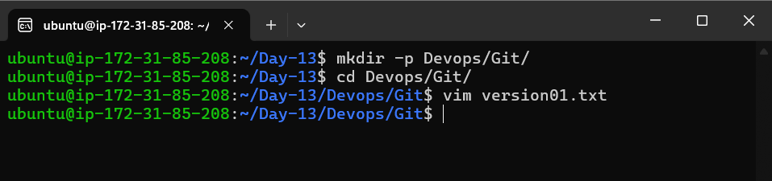

        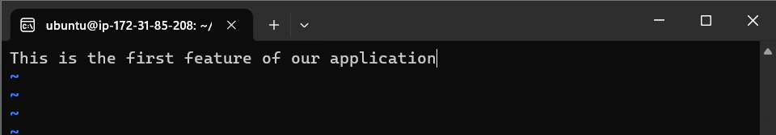


   - Create a new branch from `master`. 
     ```bash
     git checkout -b dev
     ```

      Output :
        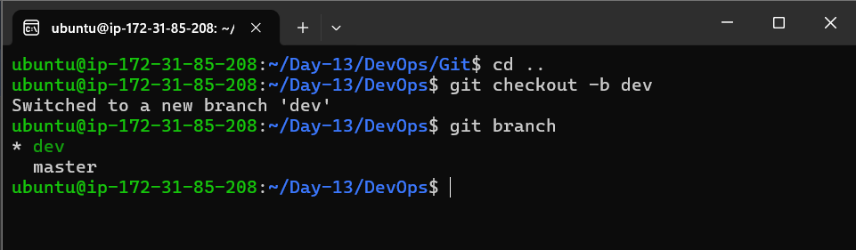
      

   - Commit your changes with a message reflecting the added feature.
     ```bash
     git add Devops/Git/version01.txt
     git commit -m "Added new feature"
     ```

      Output : 
        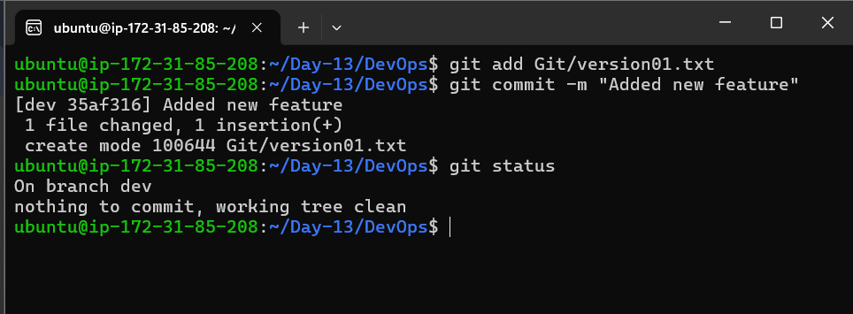
      

2. **Push Changes to GitHub:**
   - Push your local commits to the repository on GitHub.
     ```bash
     git push origin dev
     ```

      Output : 

      - Setting up remote url for repo : 

          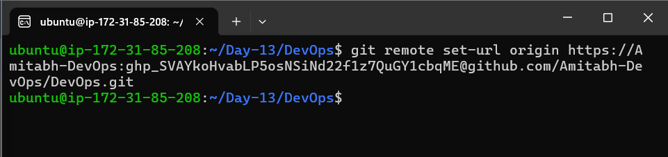


      - Pushing code to github : 
      
        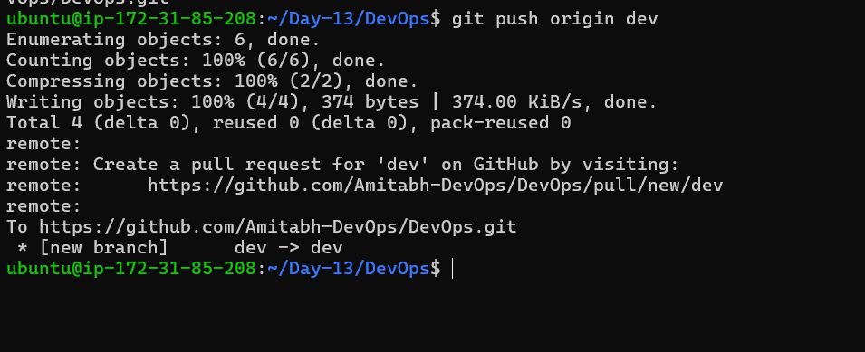


      - Showing update of Github : 

        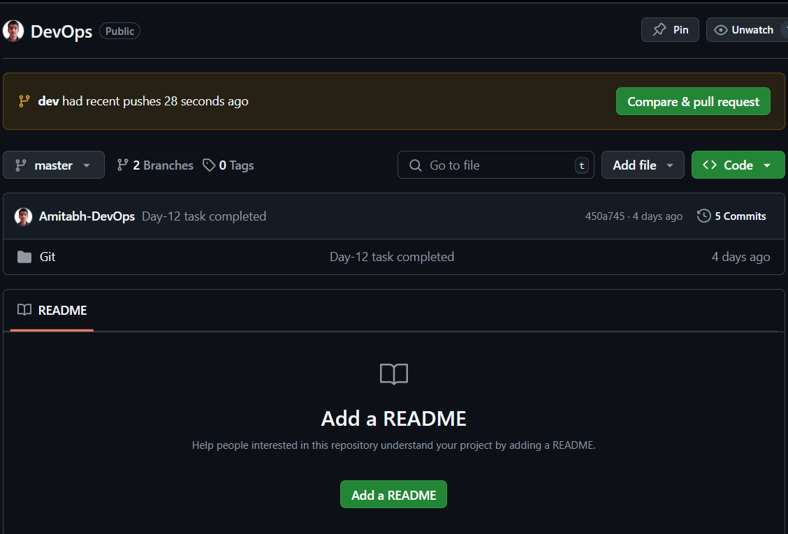


3. **Add More Features with Separate Commits:**
   - Update `version01.txt` with the following lines, committing after each change:
     - 1st line: `This is the bug fix in development branch`
       ```bash
       echo "This is the bug fix in development branch" >> Devops/Git/version01.txt
       git commit -am "Added feature2 in development branch"
       ```

        Output : 

          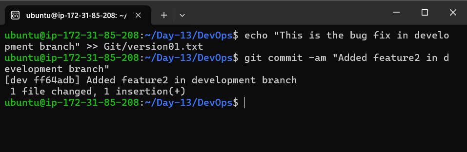
      

     - 2nd line: `This is gadbad code`
       ```bash
       echo "This is gadbad code" >> Devops/Git/version01.txt
       git commit -am "Added feature3 in development branch"
       ```

        Output : 

          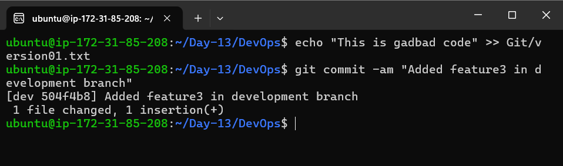
      

     - 3rd line: `This feature will gadbad everything from now`
       ```bash
       echo "This feature will gadbad everything from now" >> Devops/Git/version01.txt
       git commit -am "Added feature4 in development branch"
       ```

        Output : 

          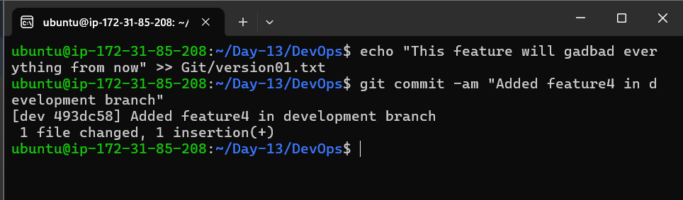
      

    Output : 
      
      - Showing `version01.txt` :
      
        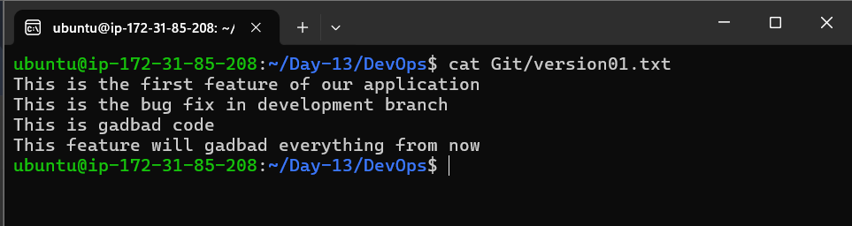


4. **Restore the File to a Previous Version:**
   - Revert or reset the file to where the content should be “This is the bug fix in development branch”.
     ```bash
     git revert HEAD~2
     ```
   - This command reverts the last two commits, effectively removing the "gadbad code" and "gadbad everything" lines.

      Output : 

        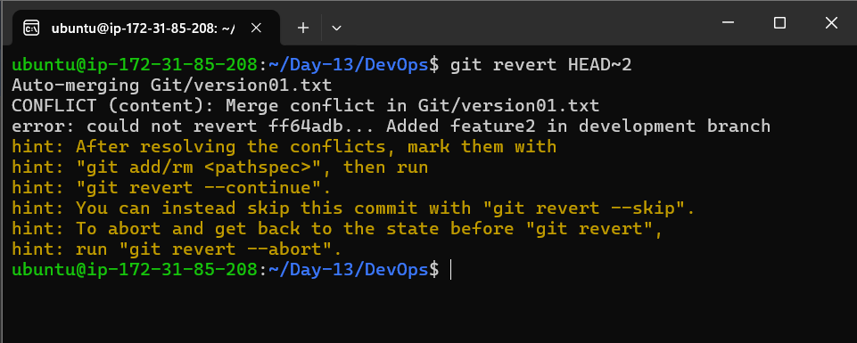

        


### Task 2: Working with Branches

1. **Demonstrate Branches:**
   - Create 2 or more branches and take screenshots to show the branch structure.

      Output : 

        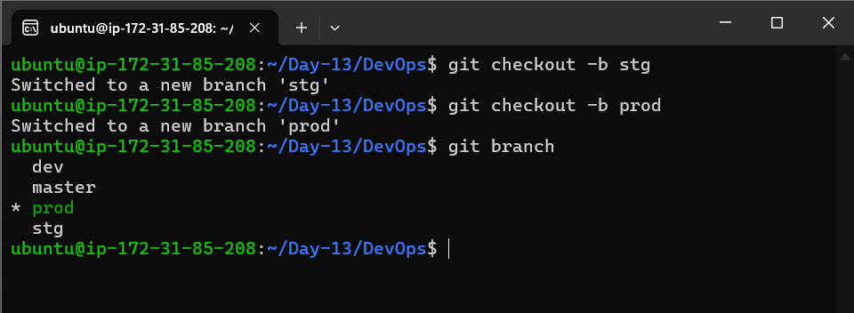


2. **Merge Changes into Master:**
   - Make some changes to the `dev` branch and merge it into `master`.
     ```bash
     git checkout master
     git merge dev
     ```

      Output : 

       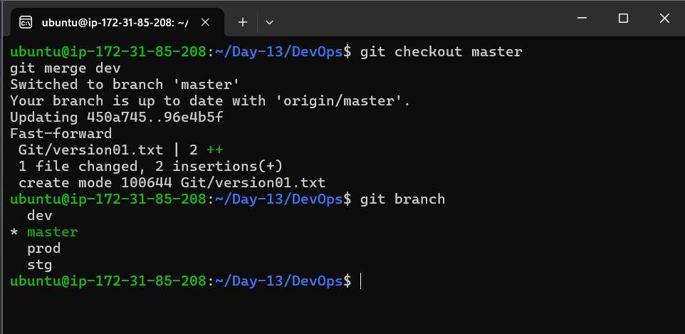


3. **Practice Rebase:**
   - Try rebasing and observe the differences.
     ```bash
     git rebase master
     ```
   
   - This is used to integrate changes from one branch into another.

   - Output : 

    - Making changes into master branch file and commiting it : 

      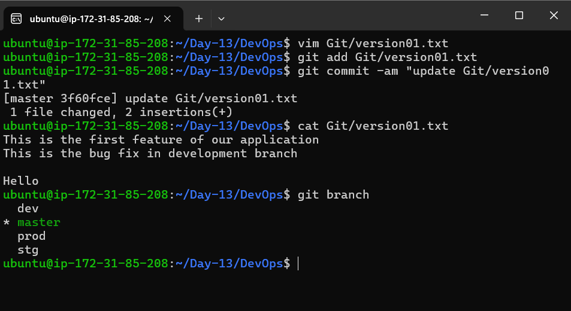


    - Switched to dev branch and checked file content before `git rebase master` : 

      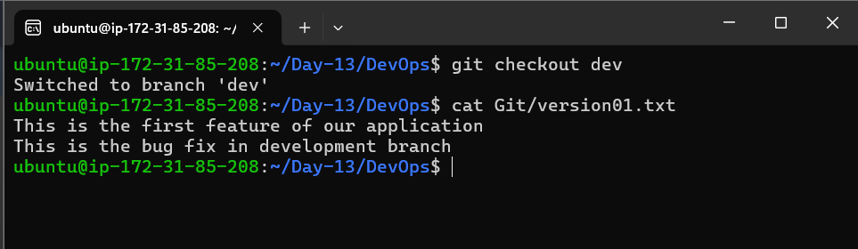


    - After doing `git rebase master` in dev branch , the file content is updated : 

      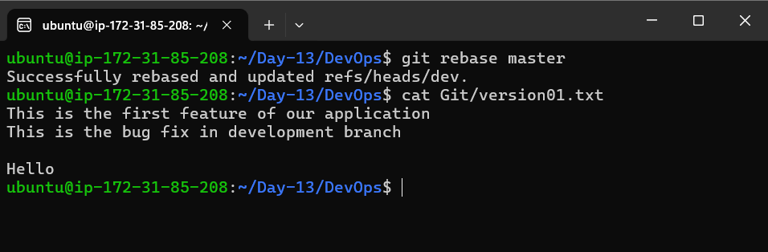


## Note:

Following best practices for branching is important. Check out these [best practices](https://www.flagship.io/git-branching-strategies/) that the industry follows.

Simple Reference on branching: [video](https://youtu.be/NzjK9beT_CY)

Advanced Reference on branching: [video](https://youtu.be/7xhkEQS3dXw)


[Linkedin](https://linkedin.com/in/amitabh-devops)