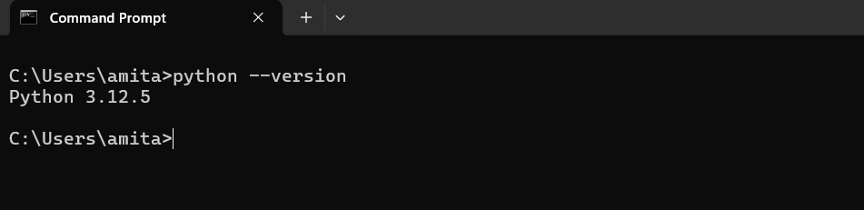
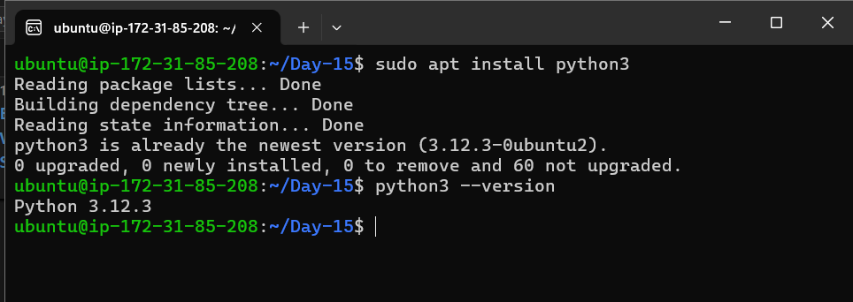

# Day 15 Answers: Basics of Python for DevOps Engineers

## What is Python?

Python is an open-source, general-purpose, high-level, and object-oriented programming language created by Guido van Rossum. It has a vast ecosystem of libraries and frameworks, such as Django, TensorFlow, Flask, Pandas, Keras, and many more.


---

## Task 1: Installing Python and Checking the Version

### Installation Steps on Different Operating Systems:

#### **1. Windows**
- **Step 1:** Download Python from the [official website](https://www.python.org/downloads/).
- **Step 2:** Run the installer and ensure you check the box **"Add Python to PATH"** before proceeding with the installation.
- **Step 3:** Open Command Prompt and type `python --version` to confirm the installation.

**Example:**
```shell
C:\Users\Amitabh> python --version
Python 3.11.0
```




#### **2. Ubuntu/Linux**
- **Step 1:** Open the terminal.
- **Step 2:** Update the package list:
  ```shell
  sudo apt update
  ```
- **Step 3:** Install Python:
  ```shell
  sudo apt install python3
  ```
- **Step 4:** Verify the installation:
  ```shell
  python3 --version
  ```

**Example:**
```shell
amitabh@ubuntu:~$ python3 --version
Python 3.8.10
```




#### **3. macOS**
- **Step 1:** Use the built-in Python or install it using [Homebrew](https://brew.sh/):
  ```shell
  brew install python
  ```
- **Step 2:** Verify the installation:
  ```shell
  python3 --version
  ```

**Example:**
```shell
MacBook-Pro:~ amitabh$ python3 --version
Python 3.9.7
```

---

## Task 2: Understanding Different Data Types in Python

Python has several built-in data types, categorized based on the kind of data they represent:

### **1. Numeric Types**
- **Integer (`int`):** Whole numbers.
  ```python
  age = 25  # Example of an integer
  print(type(age))  # Output: <class 'int'>
  ```

- **Float (`float`):** Numbers with a decimal point.
  ```python
  pi = 3.14  # Example of a float
  print(type(pi))  # Output: <class 'float'>
  ```

- **Complex (`complex`):** Numbers with a real and imaginary part.
  ```python
  complex_num = 3 + 5j
  print(type(complex_num))  # Output: <class 'complex'>
  ```

---

### **2. Sequence Types**
- **String (`str`):** A sequence of characters.
  ```python
  name = "Amitabh"
  print(type(name))  # Output: <class 'str'>
  ```

- **List (`list`):** A collection of items, ordered and mutable.
  ```python
  fruits = ["apple", "banana", "cherry"]
  print(type(fruits))  # Output: <class 'list'>
  ```

- **Tuple (`tuple`):** A collection of items, ordered but immutable.
  ```python
  coordinates = (10, 20, 30)
  print(type(coordinates))  # Output: <class 'tuple'>
  ```

---

### **3. Mapping Type**
- **Dictionary (`dict`):** A collection of key-value pairs.
  ```python
  student = {"name": "Amitabh", "age": 21}
  print(type(student))  # Output: <class 'dict'>
  ```

---

### **4. Set Types**
- **Set (`set`):** An unordered collection of unique items.
  ```python
  colors = {"red", "blue", "green"}
  print(type(colors))  # Output: <class 'set'>
  ```

- **Frozen Set (`frozenset`):** An immutable version of a set.
  ```python
  immut_colors = frozenset(["red", "blue", "green"])
  print(type(immut_colors))  # Output: <class 'frozenset'>
  ```

---

### **5. Boolean Type**
- **Boolean (`bool`):** Represents `True` or `False`.
  ```python
  is_student = True
  print(type(is_student))  # Output: <class 'bool'>
  ```

---

### **6. None Type**
- **NoneType (`None`):** Represents the absence of a value or a null value.
   ```python
   data = None
   print(type(data))  # Output: <class 'NoneType'>
   ```

---

### **Summary Table**

| Data Type   | Example                     |
|-------------|-----------------------------|
| `int`       | `x = 10`                   |
| `float`     | `pi = 3.14`                |
| `complex`   | `z = 1 + 2j`               |
| `str`       | `name = "Amitabh"`         |
| `list`      | `colors = ["red", "blue"]` |
| `tuple`     | `tup = (1, 2)`             |
| `dict`      | `student = {"key": "value"}` |
| `set`       | `unique = {1, 2, 3}`       |
| `bool`      | `is_ready = True`          |


---


[LinkedIn](https://www.linkedin.com/in/amitabh-devops/)
