# Day 17 Answers: Docker Project for DevOps Engineers

### You people are doing just amazing in **#90daysofdevops**. Today's challenge is so special because you are going to do a DevOps project with Docker. Are you excited? 😍

# Dockerfile

Docker is a tool that makes it easy to run applications in containers. Containers are like small packages that hold everything an application needs to run. To create these containers, developers use something called a Dockerfile.

A Dockerfile is like a set of instructions for making a container. It tells Docker what base image to use, what commands to run, and what files to include. For example, if you were making a container for a website, the Dockerfile might tell Docker to use an official web server image, copy the files for your website into the container, and start the web server when the container starts.

For more about Dockerfile, visit [here](https://rushikesh-mashidkar.hashnode.dev/dockerfile-docker-compose-swarm-and-volumes).


## Tasks with Solution performed by me.


### **1. Using the Python (Django Notes App) Repository**

#### Steps:

1. **Clone the Repository**:

   ```bash
   git clone -b dev https://github.com/LondheShubham153/django-notes-app.git
   cd django-notes-app
   ```

   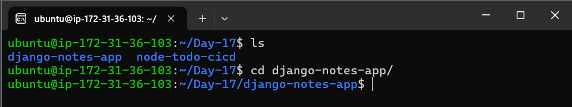

2. **Create a Dockerfile**:

   Create a `Dockerfile` in the project root with the following content:

   ```dockerfile
   FROM python:3.9-slim

   WORKDIR /app

   COPY requirements.txt .

   RUN pip install --no-cache-dir -r requirements.txt

   COPY . .

   EXPOSE 8000

   CMD ["python", "manage.py", "runserver", "0.0.0.0:8000"]
   ```

   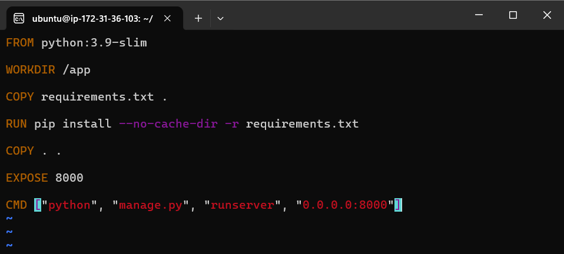


3. **Build and Run**:

   ```bash
   docker build -t django-notes-app .
   docker run -d -p 8000:8000 django-notes-app
   ```

   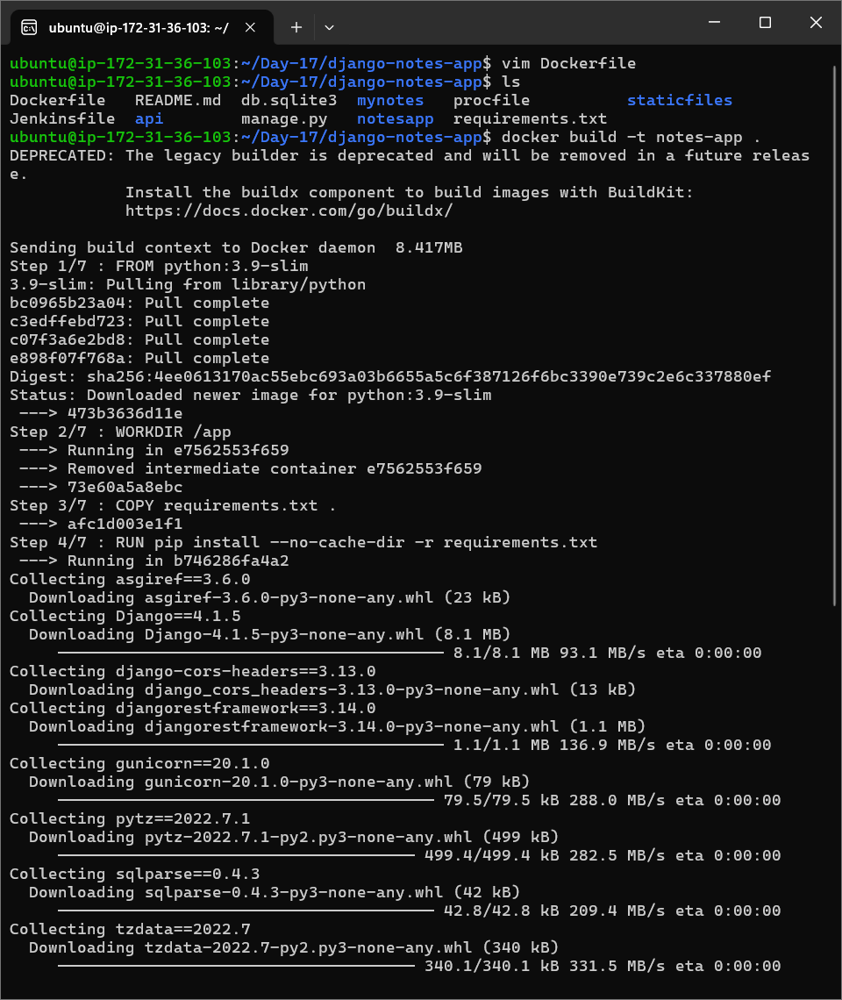

   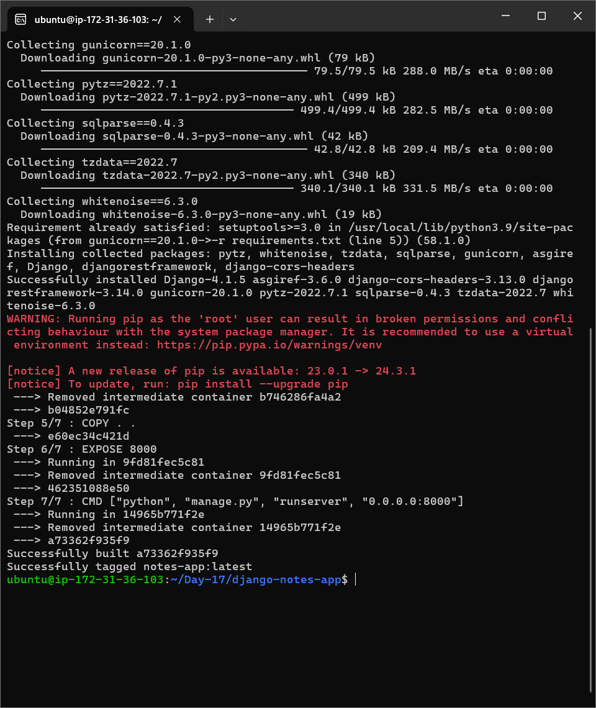

   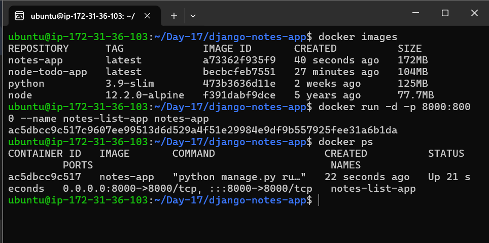


4. **Access the Application**:

   Visit `http://localhost:8000` to access the Django Notes App.

   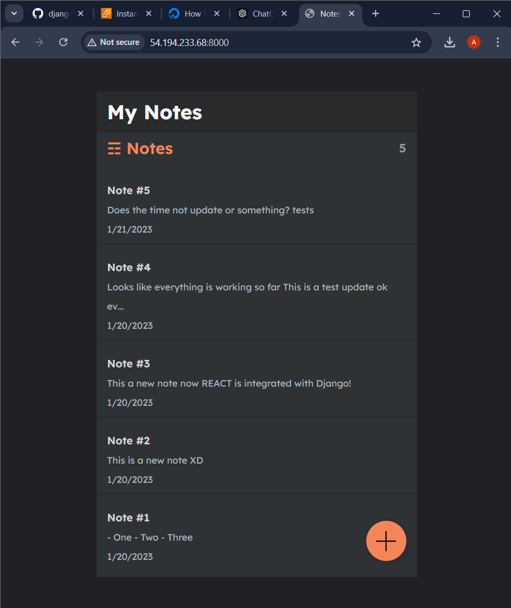

---


> Before using second application stop and remove existing above application's container to avoid error regarding ports, because we are using same port, you can use different port it is upon you.


---


### **2. Using the Node.js (To-Do App) Repository**

#### Steps:

1. **Clone the Repository**:

   ```bash
   git clone -b LondheShubham153-patch-1 https://github.com/LondheShubham153/node-todo-cicd.git
   cd node-todo-cicd
   ```

   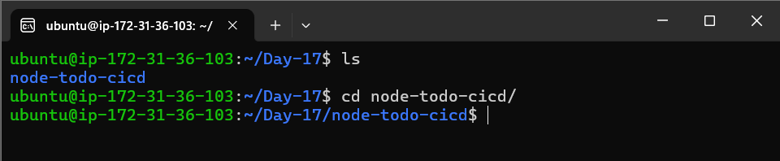


2. **Create a Dockerfile**:

   Create a `Dockerfile` in the project root with the following content:

   ```dockerfile
   FROM node:12.2.0-alpine

   WORKDIR /app

   COPY . /app

   RUN npm install

   EXPOSE 8000

   CMD ["node","app.js"]
   ```

   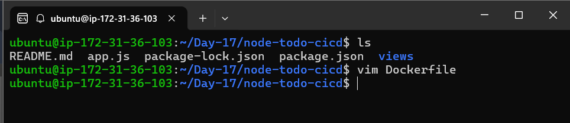

   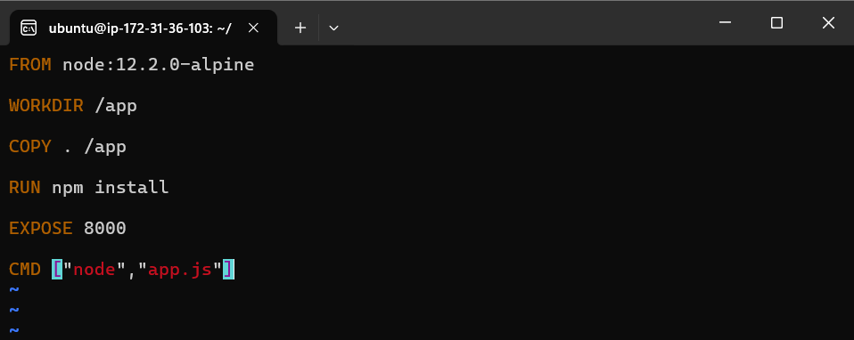


3. **Build and Run**:

   ```bash
   docker build -t node-todo-app .
   docker run -d -p 8000:8000 node-todo-app
   ```

   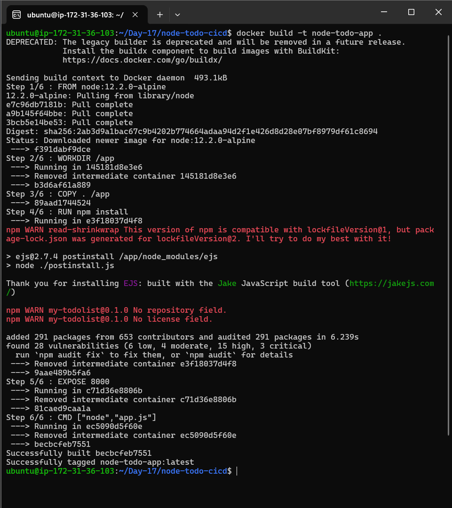

   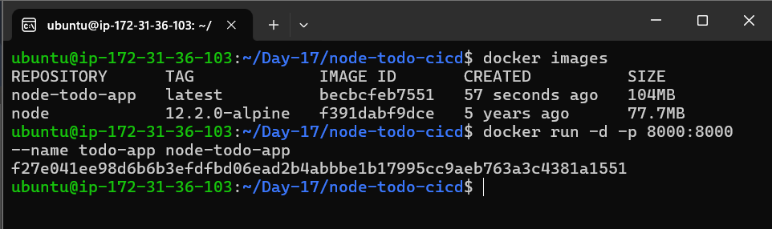


4. **Access the Application**:

   Visit `http://localhost:8000` to access the Node.js To-Do App.


   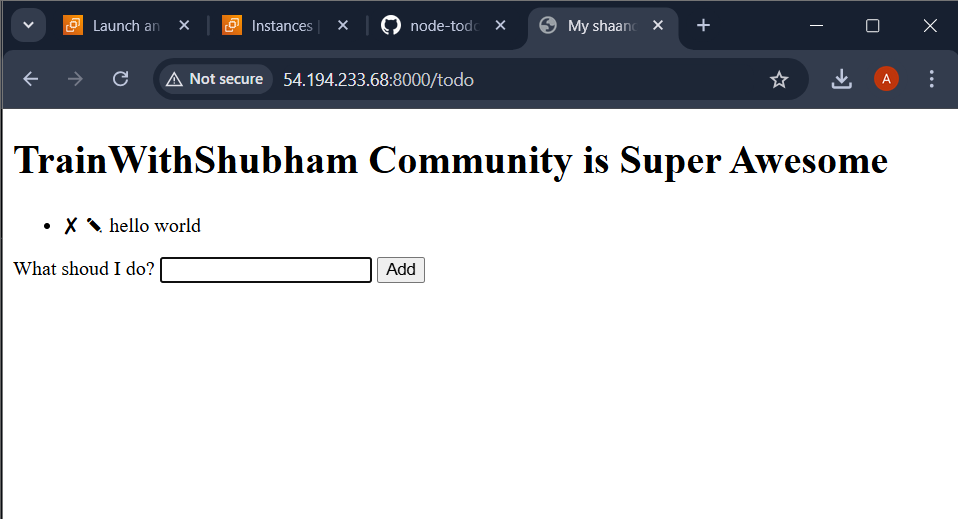

---

#### **3. Login to Docker Hub**

Before tagging or pushing your images, log in to Docker Hub with your credentials:
   ```bash
   docker login
   ```

   - Enter your **Docker Hub username** and **password/token** when prompted.

   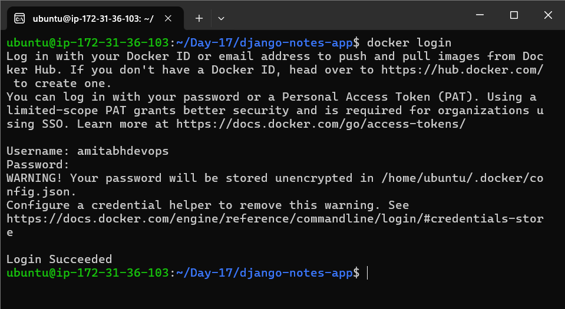


### **4. Pushing Images to Docker Hub**

For both projects:

1. **Tag the Image**:

   ```bash
   docker tag <image-name> <your-dockerhub-username>/<repository-name>:<tag>
   ```

   - Example for Django Notes App:

     ```bash
     docker tag django-notes-app yourusername/django-notes-app:latest
     ```

     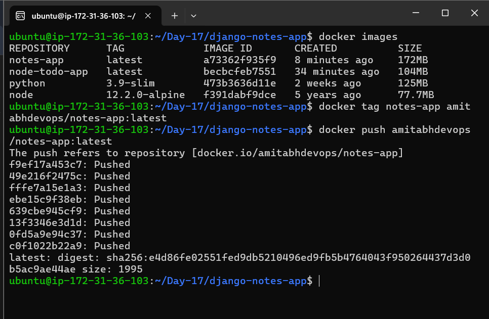
   
   - Example for Node.js To-Do App:

     ```bash
     docker tag node-todo-app yourusername/node-todo-app:latest
     ```

     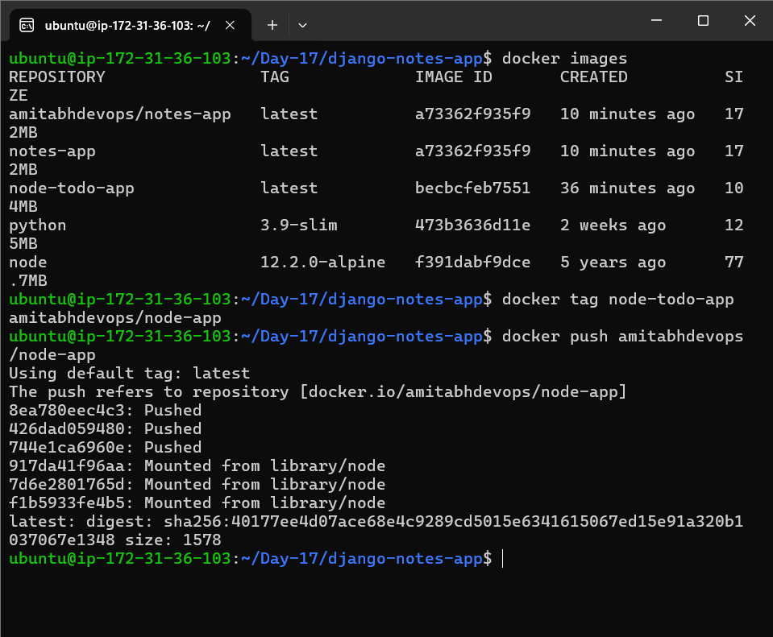

2. **Push to Docker Hub**:

   ```bash
   docker push <your-dockerhub-username>/<repository-name>:<tag>
   ```

     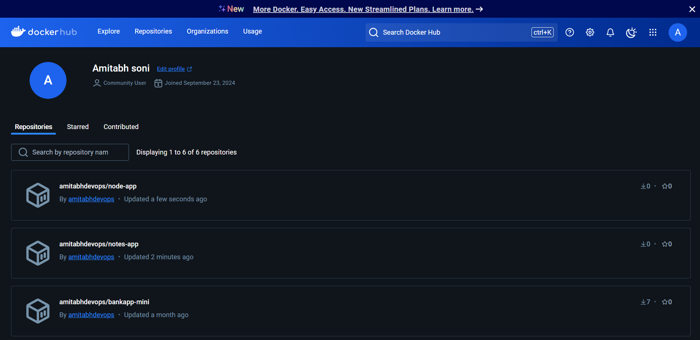


---


For a reference project, visit [here](https://youtu.be/Tevxhn6Odc8).

If you want to dive further, watch this [bootcamp](https://youtube.com/playlist?list=PLlfy9GnSVerRqYJgVYO0UiExj5byjrW8u).


[LinkedIn](https://www.linkedin.com/in/amitabh-devops/)

