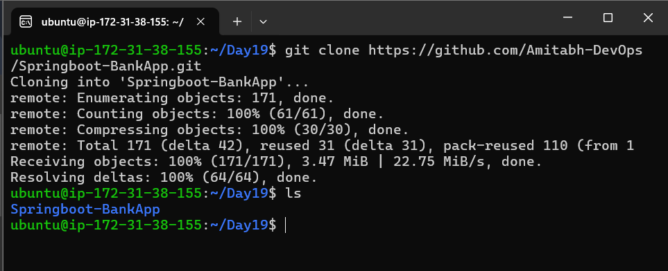
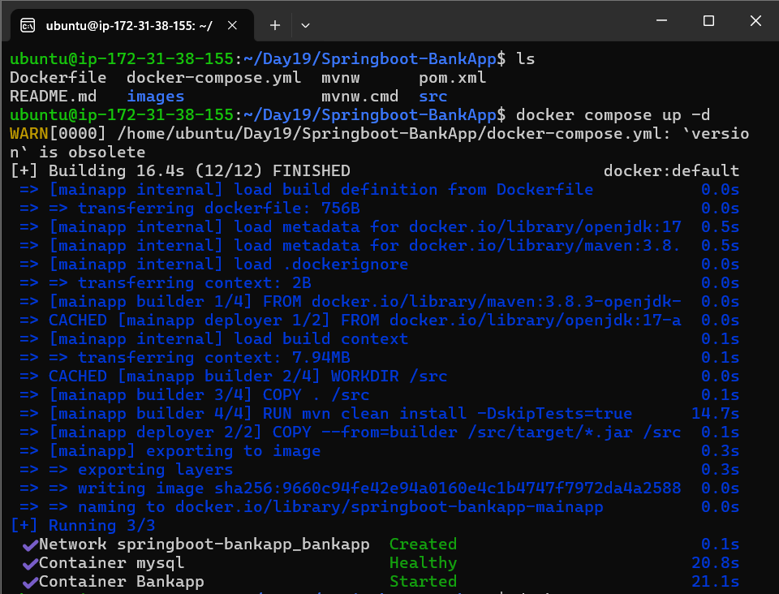
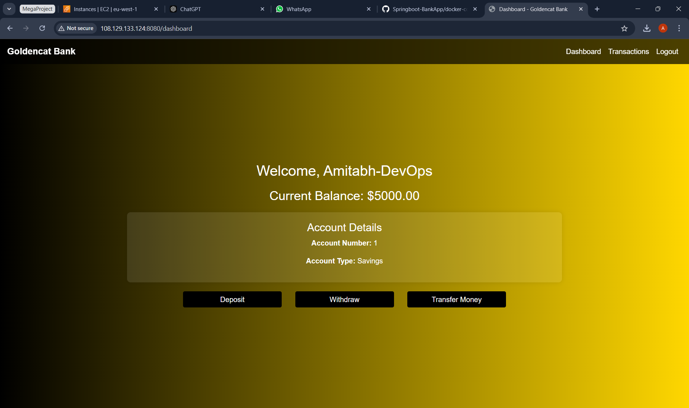
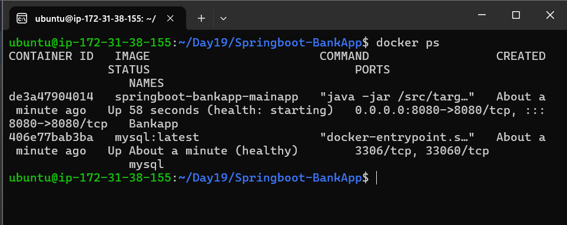
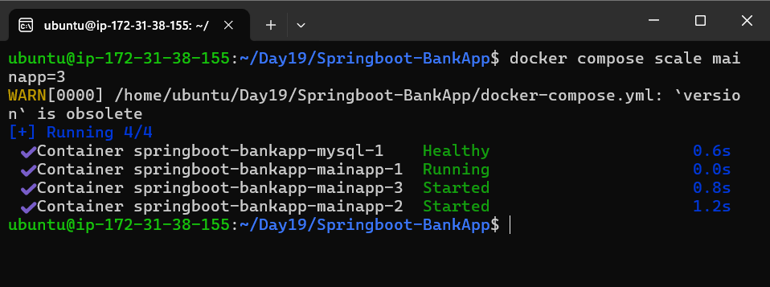
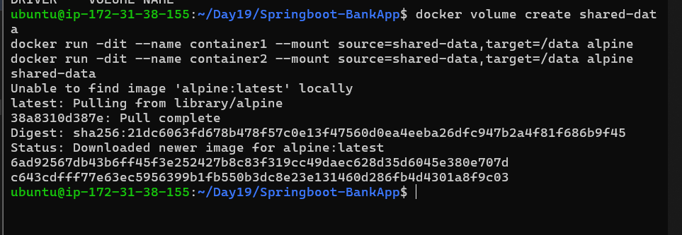
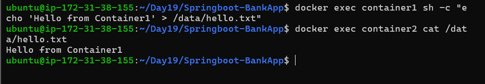
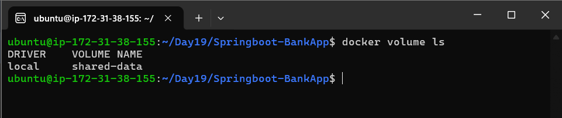
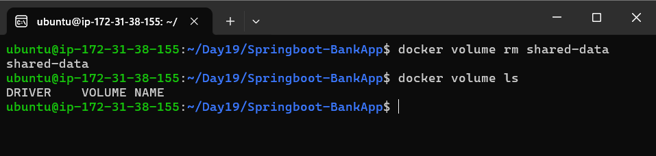

# Day 19 Task: Docker for DevOps Engineers

**So far, you've learned how to create a docker-compose.yml file and push it to the repository. Let's move forward and explore more Docker Compose concepts. Today, let's study Docker Volume and Docker Network!** 😃

## Docker Volume

Docker allows you to create volumes, which are like separate storage areas that can be accessed by containers. They enable you to store data, like a database, outside the container, so it doesn't get deleted when the container is removed. You can also mount the same volume to multiple containers, allowing them to share data. For more details, check out this [reference](https://docs.docker.com/storage/volumes/).

## Docker Network

Docker allows you to create virtual networks, where you can connect multiple containers together. This way, the containers can communicate with each other and with the host machine. Each container has its own storage space, but if we want to share storage between containers, we need to use volumes. For more details, check out this [reference](https://docs.docker.com/network/).

### **Task 1: Multi-Container Application with Docker Compose**

#### **Steps:**

### **1. Create Instance and Install Docker & Docker-Compose**

If you're using an Ubuntu server, log in to the instance and execute the following commands:

```bash
    # Update the package list
    sudo apt-get update

    # Install Docker
    sudo apt-get install docker.io

    # Start Docker service
    sudo systemctl start docker

    # Enable Docker to start on boot
    sudo systemctl enable docker

    # Install Docker Compose (v2)
    sudo apt-get install docker-compose-plugin
```

### **2. Clone the Repository**

Clone the repository with the Spring Boot application:

```bash
    git clone https://github.com/Amitabh-DevOps/Springboot-BankApp.git
    cd Springboot-BankApp
``` 




### **3. Set Up `docker-compose.yml`**

Create a `docker-compose.yml` file in the project directory. Here's the content for the `docker-compose.yml` file:

```yaml
    version: "3.8"
    services:
        mysql:
            image: mysql:latest
            environment:
                - MYSQL_ROOT_PASSWORD=Test@123
                - MYSQL_DATABASE=BankDB
            volumes:
                - ./mysql-data:/var/lib/mysql
            networks:
                - bankapp
            healthcheck:
                test: ["CMD", "mysqladmin", "ping", "-h", "localhost"]
                interval: 10s
                timeout: 5s
                retries: 3
                start_period: 30s

        mainapp:
            build: .
            environment:
                - SPRING_DATASOURCE_USERNAME=root
                - SPRING_DATASOURCE_URL=jdbc:mysql://mysql:3306/BankDB?useSSL=false&allowPublicKeyRetrieval=true&serverTimezone=UTC
                - SPRING_DATASOURCE_PASSWORD=Test@123
            depends_on:
                mysql:
                    condition: service_healthy
            networks:
                - bankapp
            restart: always
            healthcheck:
                test: ["CMD-SHELL", "curl -f http://localhost:8080/actuator/health || exit 1"]
                interval: 10s
                timeout: 5s
                retries: 5
                start_period: 30s

        nginx:
            image: nginx:latest
            ports:
                - "8080:80"
            depends_on:
                - mainapp
            networks:
                - bankapp
            volumes:
                - ./nginx.conf:/etc/nginx/nginx.conf

    networks:
        bankapp:

    volumes:
        mysql-data: 
```

### **4. Dockerfile**

Your `Dockerfile` will be used to build the Spring Boot application:

```dockerfile
    #----------------------------------
    # Stage 1
    #----------------------------------
    FROM maven:3.8.3-openjdk-17 as builder
    WORKDIR /src
    COPY . /src
    RUN mvn clean install -DskipTests=true

    #--------------------------------------
    # Stage 2
    #--------------------------------------
    FROM openjdk:17-alpine as deployer
    COPY --from=builder /src/target/*.jar /src/target/bankapp.jar
    EXPOSE 8080
    ENTRYPOINT ["java", "-jar", "/src/target/bankapp.jar"]
```

### **5. Nginx Configuration (`nginx.conf`)**

The Nginx config will set up a reverse proxy to handle the traffic between multiple Spring Boot app instances.

```nginx
    upstream mainapp {
        server mainapp:8080;
        server mainapp:8081;
        server mainapp:8082;
    }

    server {
        listen 80;

        location / {
            proxy_pass http://mainapp;
        }
    }
```

### **6. Run the Containers**

Once the files are set up, follow these steps:

- Build and start the containers in detached mode:
  ```bash
  docker compose up -d
  ```
    

    

- Check the status of your running containers:
  ```bash
  docker compose ps
  ```

    

- Scale the `mainapp` service to 3 instances:
  ```bash
  docker compose up --scale mainapp=3 -d
  ```

    

### **7. Shut Down the Environment**

To shut down the environment and remove all containers, networks, and volumes created by Docker Compose:

```bash
    docker compose down
```

---

### **Task 2: Docker Volumes**

#### **Steps:**

1. **Create two containers sharing a named volume**:
    ```bash
         docker volume create shared-data
         docker run -dit --name container1 --mount source=shared-data,target=/data alpine
         docker run -dit --name container2 --mount source=shared-data,target=/data alpine
    ```
    
    

2. **Write and read data**:
    - Write data to the volume using `container1`:
         ```bash
         docker exec container1 sh -c "echo 'Hello from Container1' > /data/hello.txt"
         ```
    - Read the same data using `container2`:
         ```bash
         docker exec container2 cat /data/hello.txt
         ```
        
    

3. **Verify the shared volume**:
    - List all Docker volumes:
    
        ```bash
            docker volume ls
        ```

        

    - Stop all container and remove it for next command 

    - Remove the volume after verification:

        ```bash
            docker volume rm shared-data
        ```

        

---


[LinkedIn](https://www.linkedin.com/in/amitabh-devops/)