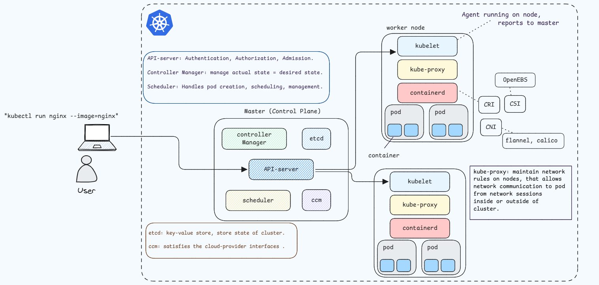

# Kubernetes Overview

## 1. What is Kubernetes?

Kubernetes is an open-source container orchestration and management tool that automates various tasks related to containerized applications, such as deploying, scaling, and load balancing containers. It simplifies managing multiple containers in production environments.

### Why do we call it K8s?

The name "K8s" is a short form of Kubernetes. The "8" in K8s represents the eight letters between the "K" and the "s" in the word Kubernetes.

---

## 2. What are the benefits of using Kubernetes?

- Simplifies container management by automating processes such as container deployment, scaling, and load balancing.
- Provides high availability and fault tolerance for containerized applications.
- Makes it easier to manage distributed workloads and ensures consistent performance across environments.

---

## 3. Kubernetes Architecture

---

## 4. What is the Control Plane?

The Control Plane (or Master Node) is the central component of Kubernetes that manages worker nodes. It handles the overall orchestration of containers, monitors the cluster, and ensures desired state management.

---

## 5. What is the difference between kubectl and kubelet?

- **kubectl**: A command-line utility used to interact with a Kubernetes cluster. It allows users to manage the cluster by creating, deleting, and managing resources like pods, services, and deployments.
- **kubelet**: A component that runs on each worker node. It ensures that the containers are running as expected on the nodes and communicates with the Control Plane to maintain the desired state.

---

## 6. Explain the role of the API server.

The API server acts as the central point of communication for the Kubernetes cluster. It exposes the Kubernetes API and facilitates communication between the various components of the cluster. It also handles external communication, allowing administrators to interact with the cluster through tools like kubectl.
