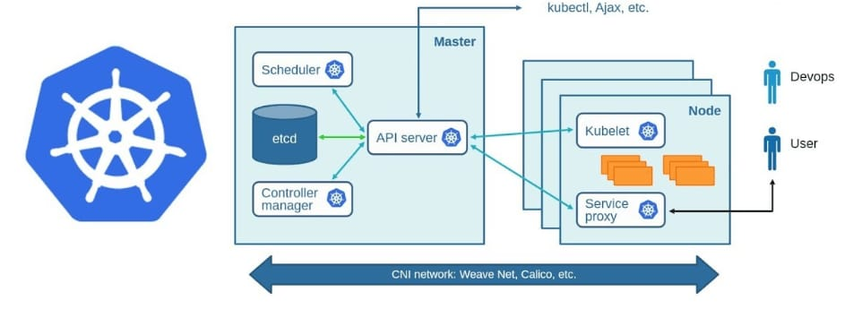

## Day 30 Task: Kubernetes Architecture

## Kubernetes Overview

With the widespread adoption of [containers](https://cloud.google.com/containers) among organizations, Kubernetes, the container-centric management software, has become a standard to deploy and operate containerized applications and is one of the most important parts of DevOps.

Originally developed at Google and released as open-source in 2014. Kubernetes builds on 15 years of running Google's containerized workloads and the valuable contributions from the open-source community. Inspired by Google’s internal cluster management system, [Borg](https://research.google.com/pubs/pub43438.html),

## Tasks

### 1. **What is Kubernetes?**
Kubernetes is an open-source platform designed to automate the deployment, scaling, and management of containerized applications. It orchestrates how containers run on a cluster of machines, ensuring reliability, high availability, and scalability.

"K8s" is shorthand for Kubernetes, where "8" represents the eight letters between the "K" and "s."

### 3. **Benefits of Using Kubernetes**
- **Scalability:** Automatically scales applications up or down based on demand.
- **Self-healing:** Restarts or replaces failed containers automatically.
- **Portability:** Runs across on-premises, hybrid, and multi-cloud environments.
- **Load balancing:** Efficiently distributes traffic across multiple containers.
- **Rolling updates and rollbacks:** Seamless application updates without downtime.

### 4. **Kubernetes Architecture**
Kubernetes architecture includes:
- **Control Plane:** Manages the overall state of the cluster and schedules workloads.
- **Worker Nodes:** Where the actual containers (or pods) run.
  
Key components:
- **API Server:** The interface for communication between users and the cluster.
- **etcd:** The database storing cluster data.
- **Scheduler:** Assigns workloads (pods) to nodes.
- **Controller Manager:** Ensures the cluster state matches the desired configuration.
- **Kubelet:** Runs on each worker node and manages pod execution.
  

### 5. **What is the Control Plane?**
The Control Plane is responsible for managing the Kubernetes cluster. It schedules workloads, monitors cluster health, and ensures that the desired state of the cluster is maintained.

### 6. **Difference Between kubectl and Kubelet**
- **kubectl:** The CLI tool used by users to interact with the Kubernetes API and manage cluster resources.
- **kubelet:** An agent that runs on each worker node to ensure containers are running as expected and communicate with the control plane.

### 7. **Role of the API Server**
The API Server is the entry point to the Kubernetes control plane, handling requests (e.g., from `kubectl`) and coordinating with other components (like etcd, scheduler) to maintain cluster operations.

Kubernetes architecture is important, so make sure you spend a day understanding it. [This video](https://youtu.be/FqfoDUhzyDo) will surely help you.

_Happy Learning :)_

 [Linkedin](https://www.linkedin.com/in/aseem-hasan-706846257/)

[← Previous Day](../day29/README.md) | [Next Day →](../day31/README.md)
