# Week 4 Challenge - Git & GitHub

## 📌 Introduction

This document contains a step-by-step guide on completing the **Week 4 Challenge** of the **#90DaysOfDevOps** program. It includes essential Git operations, branching, authentication methods, and advanced tasks like SSH setup. Each step is accompanied by images to help visualize the process.

---

## 🚀 Task 1: Fork and Clone the Repository

### 1️⃣ **Fork the Repository**

- Navigate to the **[90DaysOfDevOps Repository](https://github.com/LondheShubham153/90DaysOfDevOps)** and click **Fork**.
- This creates a copy under your GitHub account.

🖼 **Example of Your Forked Repo:** 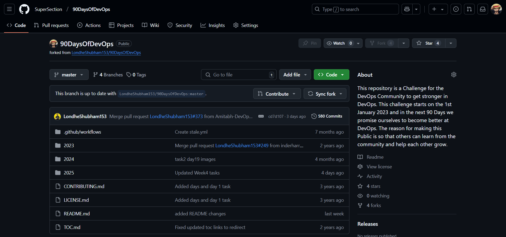

### 2️⃣ **Clone the Forked Repository**

```bash
# Replace <your-fork-url> with your forked repository link
git clone <your-fork-url>
cd 90DaysOfDevOps/2025/git/01_Git_and_Github_Basics
```

🖼 **Example of Cloning a Repo:** 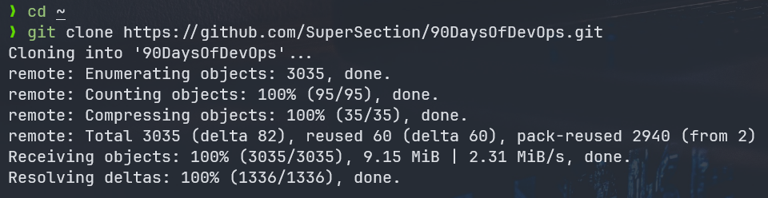

---

## 🏗️ Task 2: Initialize a Git Repository & Create a File

### 1️⃣ **Initialize Git Repository**

```bash
mkdir week-4-challenge
cd week-4-challenge
git init
```

### 2️⃣ **Create and Commit a File**

```bash
echo "Hello, this is my Git challenge!" > info.txt
git add info.txt
git commit -m "Initial commit: Add info.txt"
```

🖼 **Hands-on Example:** 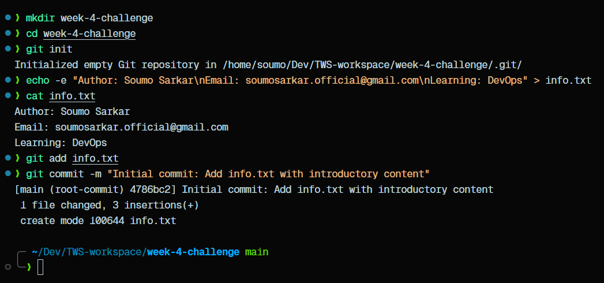

---

## 🔗 Task 3: Configure Remote & Push Changes

### 1️⃣ **Configure Remote URL with PAT**

```bash
# Replace <your-username> and <your-PAT> with actual values
git remote add origin https://<your-username>:<your-PAT>@github.com/<your-username>/90DaysOfDevOps.git
git push -u origin main
```

🖼 **Hands-on Example:** 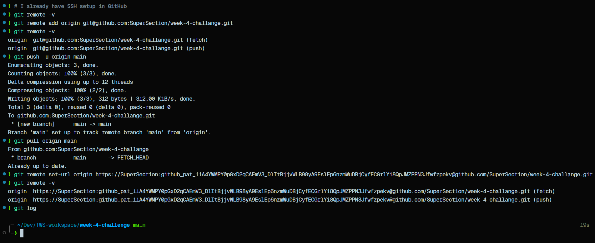

---

## 🔍 Task 4: View Git Commit History

### **Check Commit Logs**

```bash
git log
```

🖼 **Example Output:** 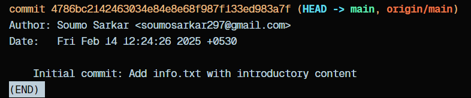

---

## 🌿 Task 5: Branching & Merging

### 1️⃣ **Create and Switch to a New Branch**

```bash
git branch feature-update
git switch feature-update
```

### 2️⃣ **Modify and Commit Changes in New Branch**

```bash
echo "Adding more details to the file." >> info.txt
git add info.txt
git commit -m "Feature update: Enhance info.txt"
git push origin feature-update
```

🖼 **Hands-on Example:** 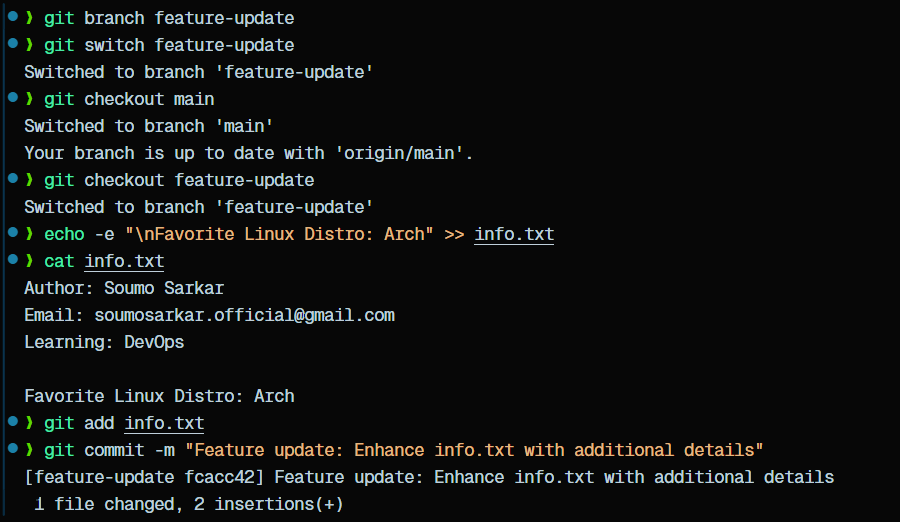

### 3️⃣ **Merge Feature Branch to Main**

- Create a **Pull Request (PR)** on GitHub and merge changes.
- Optionally you can Delete the feature branch after merging (I didn't do that for now).

🖼 **Example of Opening a Pull Request:** 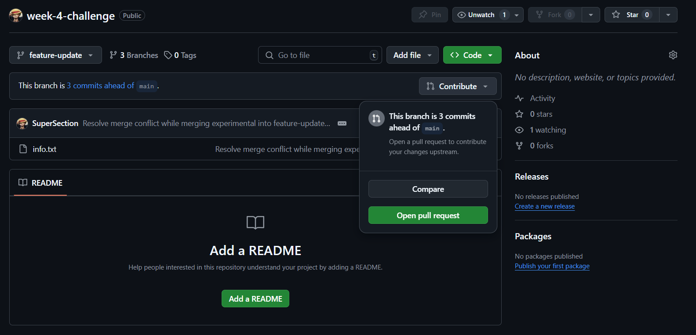
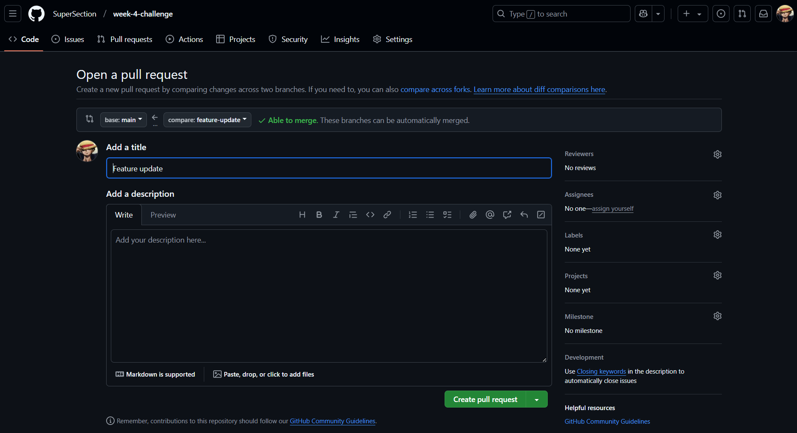

🖼 **Example of Merging a PR:** 
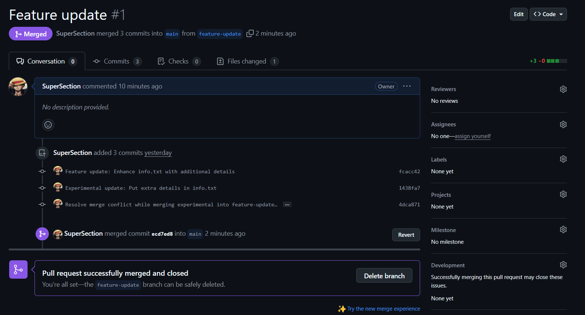

---

## 🔒 Task 6: SSH Authentication

### 1️⃣ **Generate SSH Key**

```bash
ssh-keygen -t ed25519 -C "your-email@example.com"
```

### 2️⃣ **Add SSH Key to GitHub**

- Copy the key:

```bash
cat ~/.ssh/id_ed25519.pub
```

- Go to GitHub **Settings > SSH Keys**, add the key.

🖼 **Option to add new SSH Key:** 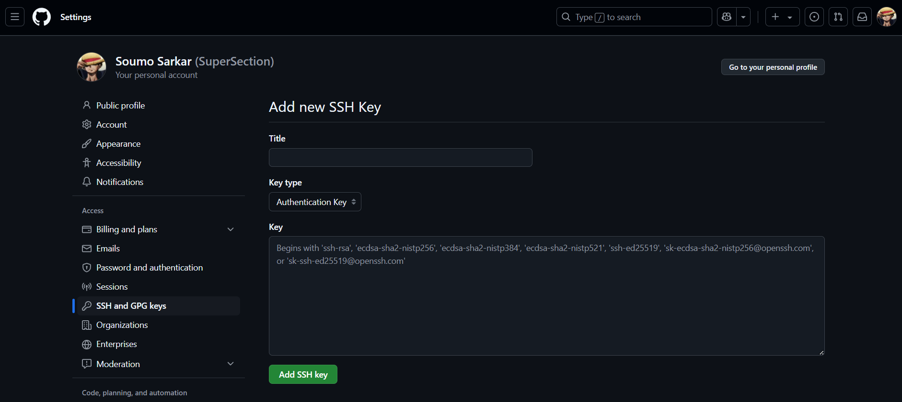

### 3️⃣ **Update Remote URL to SSH**

```bash
git remote set-url origin git@github.com:<your-username>/90DaysOfDevOps.git
git push origin feature-update
```

🖼 **Example:** 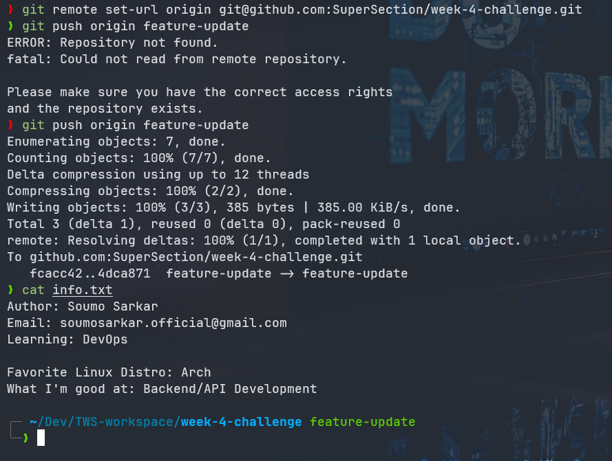

---

## 🎯 Conclusion

🎉 Successfully completed **Week 4 Challenge** of **#90DaysOfDevOps**! This challenge deepened my understanding of **Git workflows, remote configurations, authentication, and branching strategies.**

🖼 **Final Screenshot:** 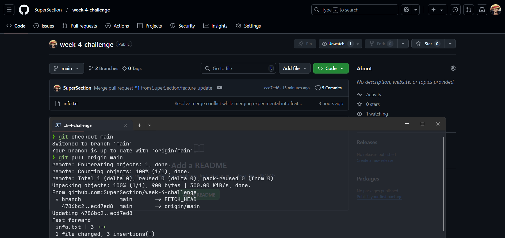
