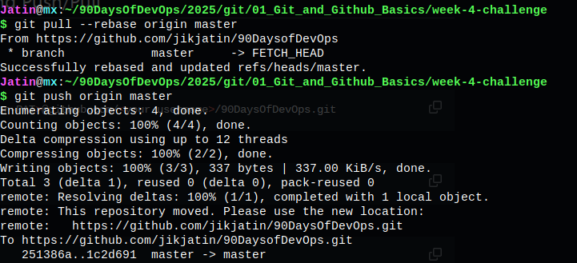

# Git and GitHub Challenge - Week 4

Welcome to the Week 4 Git and GitHub Challenge! This repository showcases the tasks completed as part of the challenge. Each task includes an explanation, commands used, and an attached image demonstrating the execution.

## Task 1: Fork and Clone the Repository
### Steps:
1. Fork the repository from GitHub.
2. Clone your forked repository:
   ```sh
   git clone <your-fork-url>
   cd 2025/git/01_Git_and_Github_Basics
   ```


## Task 2: Initialize a Local Repository and Create a File
### Steps:
1. Create a new directory for this challenge:
   ```sh
   mkdir week-4-challenge
   cd week-4-challenge
   ```
2. Initialize a Git repository:
   ```sh
   git init
   ```
3. Create a file and add initial content:
   ```sh
   echo "Your Name - Introduction" > info.txt
   ```
4. Stage and commit the file:
   ```sh
   git add info.txt
   git commit -m "Initial commit: Add info.txt with introductory content"
   ```


## Task 3: Configure Remote URL with PAT and Push/Pull
### Steps:
1. Configure remote URL:
   ```sh
   git remote add origin https://<your-username>:<your-PAT>@github.com/<your-username>/90DaysOfDevOps.git
   ```
2. Push changes:
   ```sh
   git push -u origin main
   ```
3. Pull changes:
   ```sh
   git pull origin main
   ```



## Task 4: Explore Your Commit History
### Steps:
1. View commit history:
   ```sh
   git log
   ```


## Task 5: Advanced Branching and Switching
### Steps:
1. Create a new branch:
   ```sh
   git branch feature-update
   git switch feature-update
   ```
2. Modify and commit changes:
   ```sh
   echo "More details added" >> info.txt
   git add info.txt
   git commit -m "Feature update: Enhance info.txt with additional details"
   git push origin feature-update
   ```


## Task 6: Explain Branching Strategies
A proper branching strategy helps in:
- Isolating features and bug fixes.
- Facilitating parallel development.
- Reducing merge conflicts.
- Enabling effective code reviews.


## Bonus Task: Explore SSH Authentication
### Steps:
1. Generate an SSH key:
   ```sh
   ssh-keygen
   ```
2. Add the key to GitHub and switch to SSH remote URL:
   ```sh
   git remote set-url origin git@github.com:<your-username>/90DaysOfDevOps.git
   ```
3. Test by pushing using SSH:
   ```sh
   git push origin feature-update
   ```


---
### 🎯 Submission
Ensure all updates are pushed to your repository and create a Pull Request with a proper description. Happy coding! 🚀


